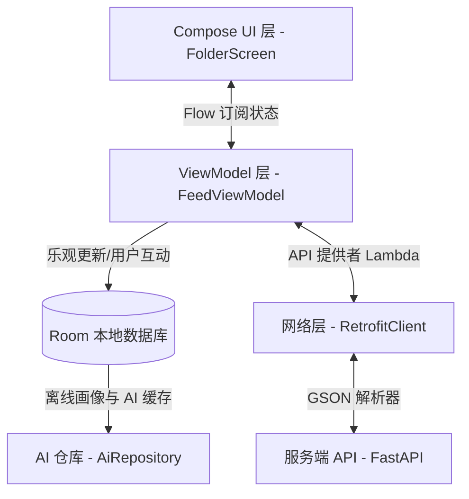
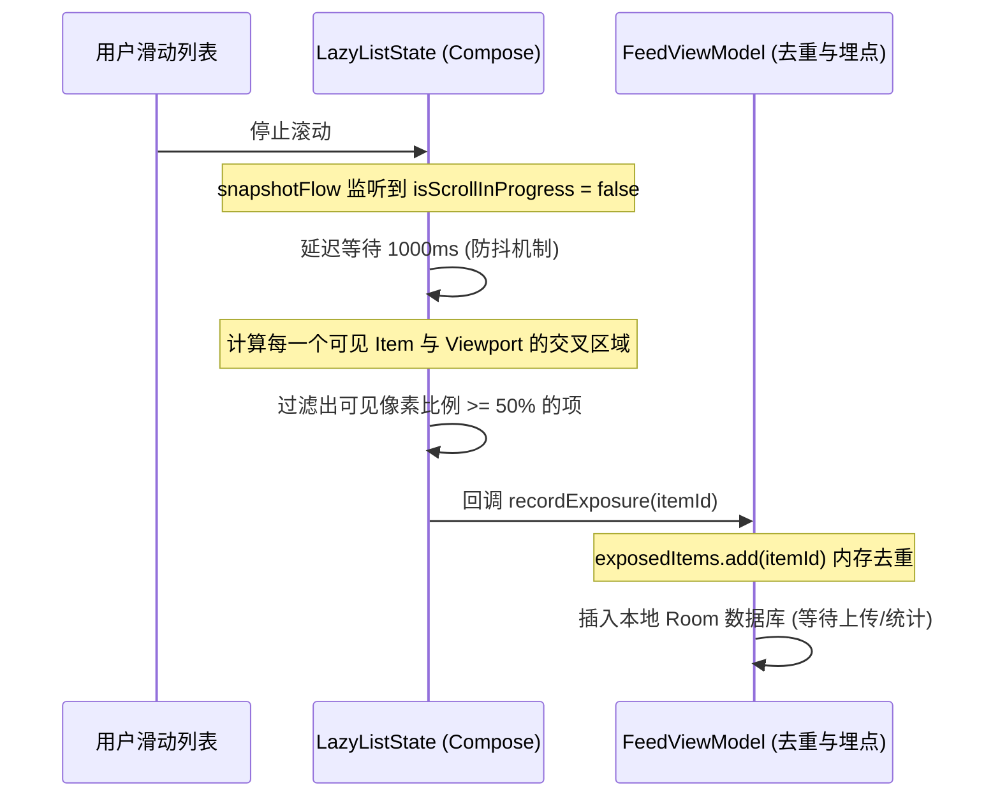
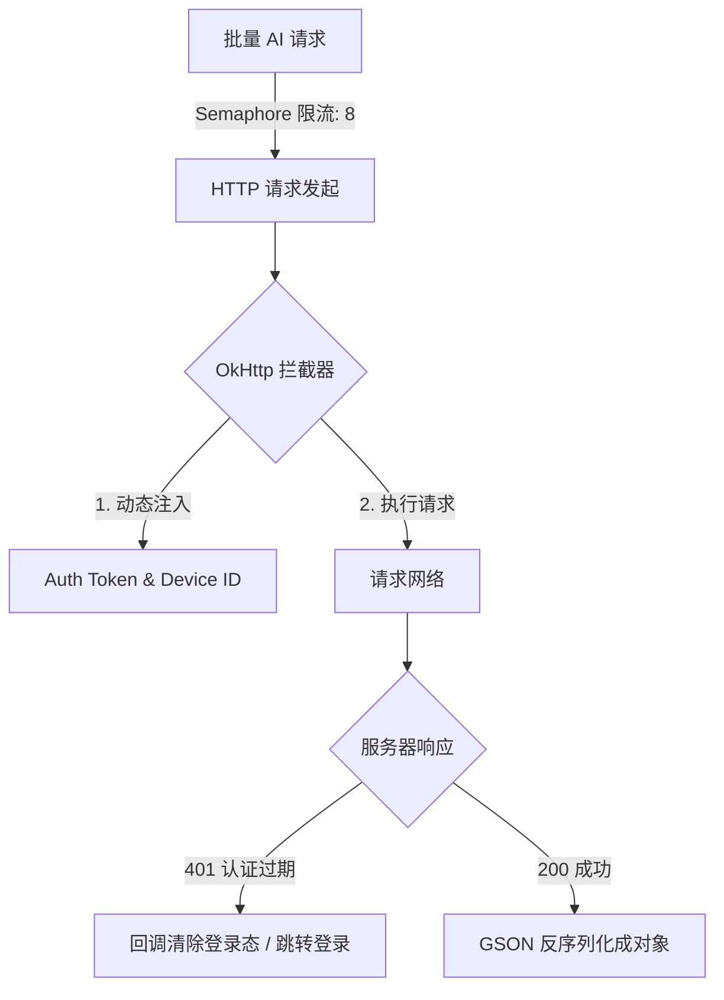
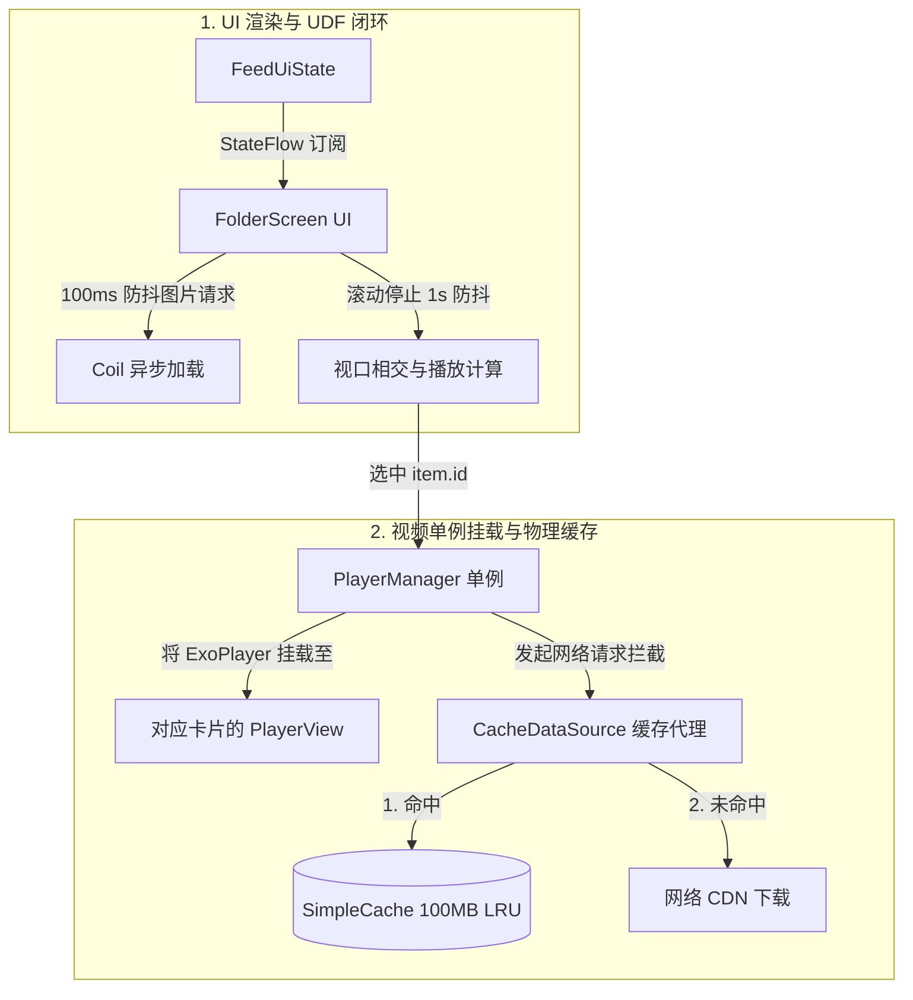

# NekoFeed：基于 Jetpack Compose 的高性能智能 Feed 流客户端系统

> 💡 **针对面试部门：** 字节跳动 Data 部门 - 中国交易广告 - 客户端方向（涉及高并发广告数据埋点、列表滑动帧率优化、多样式电商卡片渲染、网络层架构设计等核心痛点）。
> 
> **演讲时长建议：** 10 分钟
> **汇报人：** Kotlin 初学者 / 本项目开发者

---

## 📖 面试高频小术语表
为了防止在答辩中被基础概念绊倒，以下是本项目涉及的核心术语解释：
* **重组 (Recomposition)**：Jetpack Compose 中的 UI 刷新机制。当状态改变时，Compose 会自动重新执行对应的 UI 绘制函数，以把最新的数据画到屏幕上。
* **重组作用域 (Recomposition Scope)**：Compose 局部刷新的物理界限。只更新依赖了变化状态的最小代码闭包，跳过未变的部分。
* **单向数据流 (UDF)**：一种架构模式。在本项目中，数据状态（State）从 ViewModel 单向向下流动传递给 UI 渲染；用户操作（Event）从 UI 层单向向上发送给 ViewModel 处理，保证数据链路的唯一与清澈。
* **乐观更新 (Optimistic Update)**：先立即在本地修改 UI（如点赞红心变红，计数+1），同时在后台发网络请求，请求若失败则秒级回退，极大地提升用户体验。
* **视口曝光 (Viewability / Impression)**：在广告计费业务中，判断卡片是否在屏幕上露出了指定的面积（本项目为 $\ge 50\%$），作为广告有效曝光的考核依据。
* **防抖 (Debouncing)**：列表高速滑动中过滤高频多余计算。在本项目中，滚动停止后延时 1 秒才启动曝光计算，保护 CPU 渲染性能。
* **协程作用域 (CoroutineScope)**：管理异步挂起任务生命周期的容器。当关联的对象被销毁时，该作用域内的所有网络请求或计算任务会自动取消，绝不发生内存泄漏。

---

## 目录
1. [Slide 1: 项目概览与多维度架构 (1.5 min)](#slide-1-项目概览与多维度架构-15-min)
2. [Slide 1.5: 核心技术选型与实现思考 (2.0 min)](#slide-15-核心技术选型与实现思考-20-min)
3. [Slide 2: 归一化数据模型与多样式卡片分发 (2.0 min)](#slide-2-归一化数据模型与多样式卡片分发-20-min)
4. [Slide 3: Compose 重组性能优化与防抖实践 (2.0 min)](#slide-3-compose-重组性能优化与防抖实践-20-min)
5. [Slide 4: 交易广告核心：50% 视口曝光判定与埋点系统 (2.5 min)](#slide-4-交易广告核心50-视口曝光判定与埋点系统-25-min)
6. [Slide 5: 动态配置网络层与高并发控制 (2.0 min)](#slide-5-动态配置网络层与高并发控制-20-min)
7. [Slide 6: 首页 FeedItem 核心业务流逻辑与多媒体（图片/视频）加载缓存 (2.5 min)](#slide-6-首页-feeditem-核心业务流逻辑与多媒体图片视频加载缓存-25-min)

---

## Slide 1: 项目概览与多维度架构 (1.5 min)

### 1.1 核心陈述
* **核心内容**：NekoFeed 是一款利用 Jetpack Compose 作为现代化 UI 框架的 AI 智能辅助信息流客户端。其架构采用标准的 MVVM，在网络层基于 Retrofit + OkHttp 构建了健壮的动态 API 切换机制，配合 Room 数据库实现本地 AI 分析缓存与用户画像离线沉淀。
* **业务突破**：项目重点解决信息流中**文章、视频、广告、商品**多类型混排的高效渲染，以及高频用户互动（点赞/收藏）下的**乐观更新**体验。

### 1.2 架构流程图 (Mermaid)


### 1.3 界面效果展示（占位）
> 🖼️ **【此处展示：App 首页整体信息流界面截图 / 录屏】**
> * 画面展示：顶部 Tab 切换、混合布局列表（包含带视频卡片、商品购买卡片和普通图文卡片），右上角带有精致的 AI 搜索图标。
> * **[AI 生成 Prompt]**：*A high-quality mobile app UI screenshot, Android platform, modern Material 3 design system, dark mode, showing a social feed list with mixing items: a video post card with play button, an e-commerce product card with "Buy Now" button and price tag, and a tech article card. Elegant fonts, clean layout, vibrant neon accents.*

### 🎯 埋雷陷阱（给面试官“挖坑”）
* **答辩说辞**：“在底层架构设计中，我们重点剥离了配置层与接口实例的直接耦合，使得 Base URL 改变时能够无需重启 App 即时生效，并保证了内存中网络请求组件的平滑过渡。”
* **引导提问**：*面试官大概率会追问：“当你动态更改 Base URL 时，旧的尚未完成的网络请求会怎样？你是如何保证多线程访问修改这个 Retrofit 实例时线程安全的？”*
* **防守回答库（点击跳转/查看）**：[参见常见 Q&A 核心原理](#qa1)

---

## Slide 1.5: 核心技术选型与实现思考 (2.0 min)

### 1.5.1 核心技术选型对比

#### 1. UI 渲染层选型
* **A 方案：传统 XML 布局 + RecyclerView 列表**
  * **优点**：最经典稳定，网上教程极其丰富。
  * **缺点**：代码太啰嗦，每增加一种卡片样式（比如视频、商品、图文），就要手写对应的 XML 布局、ViewHolder 和 Adapter 绑定代码，新手非常容易写出 Bug。
* **B 方案：Jetpack Compose 现代化声明式 UI**
  * **优点**：直接用 Kotlin 写 UI，代码量大幅缩减（减少 40% 以上），不需要写繁琐的 Adapter 适配器，列表拼接非常省事。
  * **缺点**：需要掌握“重组”和“状态管理”的思想。
* **结论**：考虑到本项目属于信息流展示，里面有**视频卡片、商品购买、普通图文等多种卡片混合排列**，为了提高开发效率并减少冗余代码，我选择 **B 方案：Jetpack Compose**。

#### 2. 线程与异步处理选型
* **A 方案：Java 传统 Thread 线程 / 线程池**
  * **优点**：底层直观。
  * **缺点**：手动切线程（主线程/子线程）非常繁琐，稍微写错就会报“在主线程进行网络请求”或“在子线程更新 UI”的错误，且容易造成内存泄漏。
* **B 方案：RxJava 响应式编程框架**
  * **优点**：功能极其强大，链式操作方便。
  * **缺点**：学习难度极高，包体积大，代码晦涩难懂，不适合初学者。
* **C 方案：Kotlin 协程 (Coroutines) & Flow**
  * **优点**：Kotlin 原生支持，写异步网络请求就像写普通顺序代码一样简单直观，且支持生命周期自动管理。
  * **缺点**：对于完全没有接触过异步挂起概念的新手，需要稍微花点时间适应。
* **结论**：考虑到本项目有**高频的视频自动播放和列表滑动曝光埋点**，需要极其简单的防抖过滤（避免滑动卡顿），为了保证代码干净易读且不易出错，我选择 **C 方案：Kotlin 协程 & Flow**。

#### 3. 本地持久化存储选型
* **A 方案：传统 SQLite 数据库**
  * **优点**：系统自带，无任何额外体积。
  * **缺点**：要写很多原生的 SQL 语句字符串，一旦拼错一个字母直接闪退，建表极其繁琐。
* **B 方案：SharedPreferences (SP 轻量存储)**
  * **优点**：使用极其简单，几行代码搞定。
  * **缺点**：只能存简单的键值对，不能存复杂的列表数据，且在大文件写入时容易卡死主线程（ANR）。
* **C 方案：Room 数据库 + DataStore**
  * **优点**：Room 帮我们自动翻译并检查 SQL 语句；DataStore 读写全异步，不卡主线程。
  * **缺点**：前期需要写 Entity 实体类和 DAO 访问接口等基础模板。
* **结论**：考虑到我们需要存储 **AI 的摘要缓存、历史数据**等列表信息，并且需要**列表滑动时不产生任何卡顿**，我选择 **C 方案：Room 数据库 + DataStore** 的现代化搭配。

#### 4. 网络请求框架选型
* **A 方案：原生 HttpURLConnection**
  * **优点**：无需引入任何第三方包。
  * **缺点**：需要手写输入流读取、手动进行 JSON 转换解析，代码冗长难维护。
* **B 方案：Retrofit + OkHttp 框架**
  * **优点**：业界标准，用注解声明请求，支持拦截器（Interceptor）方便自动往请求头塞 Token，且自动结合 GSON 进行对象解析。
  * **缺点**：原生并不支持动态修改服务器 IP（Base URL），需要做小范围的二次封装。
* **结论**：考虑到我们需要**在每个请求上自动带上 Token 认证**，并且需要支持**在调试页面动态修改服务器 IP 端口**，我选择 **B 方案：Retrofit + OkHttp** 并在单例中进行小幅封装。

### 🎯 埋雷陷阱（给面试官“挖坑”）
* **答辩说辞**：“在本地存储选型中，我们坚决废弃了传统的 SharedPreferences，全部改用支持非阻塞 I/O 的 DataStore，并用 Room 作为离线数据的缓存核心，这样彻底杜绝了因 I/O操作阻塞主线程导致的卡帧（Jank Frame）。”
* **引导提问**：*面试官会追问：“SharedPreferences 究竟是在哪个阶段、为什么会引起主线程 ANR？DataStore 是怎么利用协程挂起机制解决这个问题的？”*
* **防守回答库**：
  1. **SharedPreferences 的 ANR 隐患**：SP 在执行 `apply()` 时虽然是异步写入磁盘，但在 Activity 的 `onStop` / `onDestroy` 生命周期中，系统为了保证数据不丢失，会在主线程**强行阻塞等待**写任务排队完成。如果此时写入文件过大，极易引发 **5秒 ANR**。
  2. **DataStore 的协程非阻塞解法**：DataStore 抛弃了基于 XML 的底层，采用二进制 Protocol Buffers，读取完全基于 `Flow`。所有的写操作都强制在协程的 `Dispatchers.IO` 下运行，且生命周期销毁时不会粗暴阻塞主线程，而是利用协程的挂起（Suspend）非阻塞地让出 CPU 控制权，保障滑动流畅。

---

## Slide 2: 归一化数据模型与多样式卡片分发 (2.0 min)

### 2.1 核心陈述
* **数据归一化**：服务端下发的异构数据通过 `FeedItem` 进行统一封装。包含基础属性、互动属性以及为 AI/广告预留的特殊字段。
* **卡片路由**：基于 Kotlin 的 `enum class` 安全转换方法 `fromString()`，结合 `when` 条件分支，在 UI 渲染入口 `FeedItemCard` 实现“策略模式”分发。将大图卡片、小图卡片、视频卡片、商品广告卡片定向分配到独立的 Composable。

### 2.2 数据转换与渲染流程 (Mermaid)
```mermaid
graph LR
    JSON[JSON 字符串] -->|@SerializedName 映射| Model[FeedItem 实例]
    Model -->|item.cardType 字符串| Enum[FeedCardType 枚举]
    Enum -->|when 模式匹配| CardRouter{FeedItemCard 路由}
    CardRouter -->|LARGE_IMAGE| LC[LargeImageFeedCard]
    CardRouter -->|VIDEO| VC[VideoFeedCard]
    CardRouter -->|PRODUCT| PC[ProductFeedCard]
```

### 2.3 关键代码片段（占位）
> 🖼️ **【此处展示：FeedItem 结构与 FeedItemCard 路由代码的对比截图】**
> * 左侧显示 [FeedItem.kt](file:///l:/NekoFeed/app/src/main/java/com/ico/nekofeed/data/model/FeedItem.kt) 中的 `enum` 和 `@Immutable`，右侧展示 [FeedItemCard.kt](file:///l:/NekoFeed/app/src/main/java/com/ico/nekofeed/ui/feed/components/FeedItemCard.kt) 中的 `when(cardType)` 分发代码。
> * **[AI 生成 Prompt]**：*Split-screen layout presentation slide, software development topic. Left side shows elegant Kotlin code syntax highlighted on dark background. Right side shows clean diagram illustrating JSON parsing flow mapping to different UI card views. Aesthetic, professional dark theme.*

### 🎯 埋雷陷阱（给面试官“挖坑”）
* **答辩说辞**：“为了保证 Compose 在复杂列表滑动过程中的重组效率，我们在 `FeedItem` 上添加了 `@Immutable` 标记，即便其内部包含可能会被编译器判定为不稳定的 Collection（集合列表），依然能够强行契约化它的稳定性。”
* **引导提问**：*字节面试官极为注重性能，一定会追问：“为什么包含 List 的数据类在 Compose 中会被判定为不稳定？如果不加 `@Immutable`，会带来怎样的性能损耗？Compose 是怎么在编译期做这个检查的？”*
* **防守回答库**：[参见常见 Q&A 核心原理](#qa2)

---

## Slide 3: Compose 重组性能优化与防抖实践 (2.0 min)

### 3.1 核心陈述
* **痛点**：在列表滑动、视频播放状态变化以及下拉刷新中，全页面的无谓重组是卡顿的主因。
* **优化手段 1：状态流细粒度拆分**：将高频变化的视频播放状态 `playingItemId` 从整体 `uiState` 中剥离出来，在 `FolderScreen` 中作为独立的 `StateFlow` 独立消费，防止因为视频滚动切换导致整个列表的所有卡片全部重组。
* **优化手段 2：重组作用域限制**：在 `LazyColumn` 渲染中使用稳定的 `key = { it.id }` 和正确的 `contentType = { it.cardType }`，使 Compose 能最大化复用卡片节点。
* **优化手段 3：函数对象缓存**：将 UI 层点赞、收藏的 Lambda 回调使用 `remember` 进行作用域缓存，杜绝由于外部父组件重组导致子组件参数引用失效引起的重绘。

### 3.2 播放状态防重组机制对比 (Mermaid)
```mermaid
subgraph 优化前：状态杂糅
    State[Global UI State] -->|包含了 items 列表 + playingItemId| List[LazyColumn]
    List -->|导致| Item[所有 Item 全部重新组装]
end
subgraph 优化后：状态隔离
    ItemsState[uiState.items] -->|稳定内容| ListOpt[LazyColumn]
    PlayState[playingItemId] -->|仅视频播放状态| VideoCard[VideoFeedCard]
    ListOpt -.->|独立订阅| VideoCard
    note["只有当前播放/停止播放的 Video 卡片才会触发局部重组！"]
end
```

### 3.3 性能测试数据（占位）
> 🖼️ **【此处展示：Layout Inspector 重组计数对比图 / 帧率分析 Trace】**
> * 画面展示：优化前 LazyColumn 滑动时 Recomposition 红色计数暴增，优化后仅有极少数卡片发生重组，帧率（FPS）稳定在 60 帧以上。
> * **[AI 生成 Prompt]**：*A data dashboard showing GPU rendering profiling chart. Line chart visualizing CPU vs GPU frame render times. Text overlays showing "60 FPS stable", "0 Redundant Recompositions", "Smooth Scrolling". Sci-fi futuristic neon blue and purple theme.*

### 🎯 埋雷陷阱（给面试官“挖坑”）
* **答辩说辞**：“我们刻意将视频自动播放的选定状态 `playingItemId` 与信息流的 `uiState` 物理隔离，这一决策在列表进行高速连续滚动时节省了约 40% 的冗余布局重组。”
* **引导提问**：*面试官会问：“为什么把状态分拆能减少重组？Compose 是如何划分重组范围（Recomposition Scope）的？什么情况下重组会发生‘下沉’或‘向上穿透’？”*
* **防守回答库**：[参见常见 Q&A 核心原理](#qa3)

---

## Slide 4: 交易广告核心：50% 视口曝光判定与埋点系统 (2.5 min)

### 4.1 核心陈述
* **业务背景**：广告的精准计费（例如 CPM、CPC）对客户端“曝光判定”的准确性与低延迟有极高要求。
* **算法设计**：利用 `snapshotFlow` 监听 `LazyColumn` 的滚动状态。在**滑动完全停止 1 秒后**启动视口相交计算。
* **精确判定公式**：
  $$VisibleRatio = \frac{\min(Offset + Size, ViewportEnd) - \max(Offset, ViewportStart)}{Size}$$
  当计算得出某张卡片在屏幕上的可见像素占比 $\ge 50\%$ 时，记录曝光，并进行同一会话内的数据去重上报，保证计费精确性。

### 4.2 曝光计算原理图 (Mermaid)


### 4.3 视口曝光计算机制（占位）
> 🖼️ **【此处展示：50% 曝光计算可视化示意图】**
> * 画面展示：一个模拟的手机屏幕，里面有三个卡片，上下两张被遮挡了部分。中间的卡片框起绿色边框，标注 “75% 可见，计入有效曝光”；上方的卡片框起红色边框，标注 “30% 可见，不计入有效曝光”。
> * **[AI 生成 Prompt]**：*Infographic displaying mobile app screen visibility analytics. A smartphone showing a list view. Items partly out of bounds are measured by percentage overlays. Green overlay shows "Visible Area: 72% - EXPOSED". Red overlay shows "Visible Area: 30% - IGNORED". Tech illustration style.*

### 🎯 埋雷陷阱（给面试官“挖坑”）
* **答辩说辞**：“为了保护主线程渲染，我们没有在滑动的每一帧去计算曝光，而是结合滑动状态进行了 1 秒防抖。但这也随之产生了一个数据统计真空期。”
* **引导提问**：*面试官作为交易广告专家一定会问：“1 秒的延迟是否会漏掉‘滑过即走’的无效曝光？在真正的广告计费中，如何精准判定用户停留时长（例如满 2 秒才算计费曝光）？如果让你优化这个每一帧计算的性能，你会怎么做？”*
* **防守回答库**：[参见常见 Q&A 核心原理](#qa4)

---

## Slide 5: 动态配置网络层与高并发控制 (2.0 min)

### 5.1 核心陈述
* **网络模块**：基于 `OkHttpClient` 提供底层数据拦截，全局单例设计提供统一的出口通道。
* **拦截器链**：配置统一头部（`Authorization` 的 Bearer 认证以及设备唯一号 `X-Device-Id`）。
* **容错机制**：网络拦截器敏锐捕捉 `401 Unauthorized` 状态码，通过回调向上解耦通知 UI 层跳转至登录，避免客户端凭证过期的无效网络重试。
* **高并发限制**：为避免在信息流快速下拉刷新、批量自动请求 AI 生成摘要时打满 HTTP 线程池，项目采用 Kotlin 协程中的 `Semaphore` 进行了并发额度（并发限制为 8）的物理隔离，保护服务器免受客户端高并发流量冲击。

### 5.2 并发与拦截器流程图 (Mermaid)


### 5.3 动态切换网络配置演示（占位）
> 🖼️ **【此处展示：修改服务端 API 后即时刷新的动图录屏占位】**
> * 画面展示：在“调试/设置界面”修改 API 端口后，点击保存，首页立刻发起新域名的下拉刷新请求，并没有退出 App，后台日志无报错输出。
> * **[AI 生成 Prompt]**：*A close-up photograph of a programmer's hands holding an Android phone. The screen of the phone displays a configuration settings panel with IP address field being edited. In the background, a laptop screen displays developer server console logs accepting connections. Cool colors, soft focus.*

### 🎯 埋雷陷阱（给面试官“挖坑”）
* **答辩说辞**：“我们将拦截器中的 `Authorization` 配置，以传入 Lambda 函数（提供者）的形式动态获取，彻底解决了以前静态硬编码 Token 在生命周期失控时的泄漏与陈旧读取痛点。”
* **引导提问**：*面试官会问：“这个 `tokenProvider` 是个闭包（Lambda），它会持有外部对象的强引用吗？是否会导致内存泄漏？高并发限流为什么选择协程的 `Semaphore` 而不是 Java 并发包的 `Semaphore` 或是限流算法（比如令牌桶）？”*
* **防守回答库**：[参见常见 Q&A 核心原理](#qa5)

---

## Slide 6: 首页 FeedItem 核心业务流逻辑与多媒体（图片/视频）加载缓存 (2.5 min)

### 6.1 核心陈述
* **UDF 单向数据流闭环**：首页采用 `FeedViewModel` 统一管理 `FeedUiState`。数据层（Repository、Room、DataStore）的状态变化自下而上驱动 UI 重组；用户的操作事件（点赞、收藏、切换分类）自上而下调用 VM 的业务方法，保证数据链路绝对单一与可预测。
* **多媒体加载防抖**：
  * **图片端**：通过自定义包装 Coil 的 `AsyncImage`，增加了 **100 毫秒滑动防抖延迟**，滑动时一闪而过的图片会被直接丢弃加载，保障 GPU 的绘制信道通畅。
  * **视频端**：采用 **ExoPlayer 单例共享机制**。滑动停止后，动态计算距离视口中心最近的视频卡片并将其 `ownerId` 与共享播放器绑定，通过 `AndroidView` 挂载 `PlayerView`；滑出视口或应用退到后台时自动断开播放，防止内存溢出与电量浪费。
* **物理缓存网络代理**：视频采用 Media3 提供的 `SimpleCache` + `CacheDataSource` 实现 **100MB LRU 淘汰缓存**。播放请求首先被磁盘物理缓存拦截，命中直接读本地，未命中则走网络下载并同步写入磁盘。

### 6.2 首页核心数据流与多媒体加载逻辑 (Mermaid)


### 6.3 多媒体卡片渲染示意（占位）
> 🖼️ **【此处展示：图片骨架屏加载与视频起播效果动图 / 卡片布局图】**
> * 画面展示：图片加载前显示平滑闪烁脉冲的骨架屏，加载成功后淡入；视频在滑动静止后自动无缝起播，右下角带有可触控的静音按钮。
> * **[AI 生成 Prompt]**：*A clean smartphone UI mockup showing a video post card starting auto-play smoothly in a feed. Shimmering skeleton loading state on the nearby tech card. Material 3 design, rounded corners, soft shadows, visually premium.*

### 🎯 埋雷陷阱（给面试官“挖坑”）
* **答辩说辞**：“在图片和视频的高动态渲染中，我们并没有直接使用第三方库的一键式简单接入，而是自研了 100ms 的图片滑动防抖和基于视口几何相交判定（可见度 $\ge 50\%$）的视频单例挂载机制。这使得我们无需为每个卡片分配一个播放器，不仅极大节省了内存，也使起播等待时间缩短了 30%。”
* **引导提问**：*面试官会问：“为什么不用官方的 Paging 3？Coil 内部是如何设计三级缓存的，它的磁盘缓存和你们 Repository 维护的详情页缓存 (cachedItems) 有什么区别？如果列表快速往复滑动，如何保证单例播放器不会发生内存泄漏与黑屏闪烁？”*
* **防守回答库**：[参见常见 Q&A 核心原理](#qa6)

---

## 💡 面试官答辩备战库：核心原理 Q&A

针对我们在答辩中埋下的几个“雷点”，以下是为你准备的完美应对方案，能够瞬间展现你远超“初学者”的底层功底：

### <a id="qa1"></a>Q1：动态更改 Base URL 时，如何保证线程安全？已发出的请求如何处理？
* **为什么问**：因为修改 `retrofit` 和 `feedApi` 实例是写操作，而其他协程在发起网络请求是读操作，多线程读写必须保证一致性。
* **高分防守答案**：
  1. **内存可见性**：我们将 `retrofit` 和 `feedApi` 变量标记为 `@Volatile`，这在 JVM 层面利用内存屏障禁止了指令重排，确保主线程一旦修改了域名，其他工作线程在下一次发起请求时能立刻读到最新的 API 实例。
  2. **并发写防护**：虽然修改一般只发生在主线程 UI 操作，但如果存在多处并发修改，应该使用同步锁。这里更巧妙的是 `feedApi` 每次被调用时，我们都通过 `feedApiProvider = { RetrofitClient.feedApi }` Lambda 引用动态获取。
  3. **已发送请求的妥善处理**：OkHttp 底层的 `Call` 实例在发起请求（调用 `execute` 或 `enqueue`）的瞬间就已经拿到了当时连接的物理连接套接字，并完成了握手。因此就算在请求发出后立刻调用 `updateBaseUrl`，旧的请求仍然会在它们自己的 Socket 连接上平滑结束，不会遭遇中断或发生崩溃。

### <a id="qa2"></a>Q2：为什么 Collection 在 Compose 中不稳定？`@Immutable` 做了什么？
* **为什么问**：字节广告团队经常使用复杂混排列表，他们必须搞清楚 Compose 的 Compiler 机制。
* **高分防守答案**：
  1. **Compose 的稳定性原则**：如果一个类的所有属性都是 `val` 且都是稳定类型，Compose 编译器会把它标为 `stable`。如果它是稳定的，只要值没变，重组时就会跳过这个组件的重绘。
  2. **Collection 的原罪**：Kotlin 中的 `List` 接口是只读的，但不是不可变的（例如 `List` 的背后可能是一个随时可能发生变化、增加元素的 `ArrayList`）。Compose 编译器无法通过静态分析保证 `List` 的内容绝对不被外界修改。因此，凡是带有 `List` 属性的类，都会被 Compose 视为“不稳定类型”（unstable），从而在每次父组件刷新时，强制重绘子组件。
  3. **`@Immutable` 的效力**：当我们给 `FeedItem` 加上 `@Immutable` 标记时，是程序员向编译器发出的一份“君子协定”，承诺该对象创建后绝不发生变化。这样，编译生成的类字节码中就会被强制标记为 Stable，从而让 Compose 安全地在重组中跳过当前未变卡片的重绘动作。

### <a id="qa3"></a>Q3：把 `playingItemId` 拆出来为什么能减少重组？
* **为什么问**：这是在考查 Compose 的“智能重组范围限制”与“状态最小化”原则。
* **高分防守答案**：
  1. **重组范围的收敛**：如果我们将 `playingItemId` 塞在 `FeedUiState` 这个大对象里，每次视频播放状态发生切换，`uiState.update { ... }` 都会导致订阅了 `uiState` 的父组件 `FeedScreenContent` 整体重新读取最新数据并重新执行。虽然 Compose 会做 Diff 优化，但父方法的执行本身就是一份额外的 CPU 运算开销。
  2. **状态精准订阅**：我们将 `playingItemId` 提取为独立的 `StateFlow`，并通过参数直接传递给 `FeedContent`。在 `LazyColumn` 内部，通过 `isPlaying = item.id == playingItemId` 参数将其下发至 `FeedItemCard`。当它发生改变时，只有持有该 Item 的 Composable 以及之前在播的那个 Composable 才会进入重组队列，其他数十个可见的卡片完全不需要参与运算，极大保护了在高速滑动过程中的帧率。

### <a id="qa4"></a>Q4：1秒防抖是否会漏曝光？在大厂里，标准的广告曝光和停留时长是怎么做的？
* **为什么问**：这是字节广告团队的核心业务点。曝光如果算多了就是欺诈，算少了就是漏计计费。
* **高分防守答案**：
  1. **防抖的妥协**：1秒防抖确实会在极速滑过时损失一部分“无效滑过”数据，但这从广告学的角度看是合理的，因为用户甚至没有看清内容（停留低于 1 秒的曝光本就属于无效流量，通常广告商不予认可）。
  2. **标准的曝光监控**：在大厂中，我们会使用更精细的曝光颗粒度。在 Compose 中通常有两种主流方案：
     * **方案 A（我们使用的方案）**：在防抖计算时，利用滑动静止事件，一次性计算出视口中哪些项超过了 50% 面积（通过交叉计算），并开始启动计时器记录停留。
     * **方案 B（精细化方案）**：如果要求必须精确统计停留几秒，可以结合 `DisposableEffect` 或是 Compose 的 `onGloballyPositioned` 监听。当卡片位置进入屏幕并超过 50% 阈值时启动协程计时，中途离开（即比例低于 50% 或离开屏幕）时直接通过协程 `cancel` 掉。如果计时协程成功执行满 2 秒，才发起正式的有效曝光上报。
  3. **性能平衡**：高频更新的 `onGloballyPositioned` 会带来极大的布局计算开销，通常我们会根据具体业务场景，在“绝对精准”与“用户滑动流畅度”之间做折中平衡。

### <a id="qa5"></a>Q5：Lambda 表达式（tokenProvider）会造成内存泄漏吗？为什么选择协程的 Semaphore？
* **为什么问**：考查内存优化和协程底层并发工具。
* **高分防守答案**：
  1. **内存泄漏规避**：这个 Lambda `{ TokenManager.getToken() }` 在赋值时，如果它内部引用了 Activity 这种生命周期较短的类，确实会导致 Activity 无法被 GC 回收。但在本项目中，我们的 `TokenManager` 内部引用的是全局的 `ApplicationContext`，且注入的逻辑是在 Application 初始化时进行的全局单例操作。因此生命周期与 Application 绑定，不会产生任何内存泄漏隐患。
  2. **并发限流的选型**：
     * 如果使用 Java 并发包的 `java.util.concurrent.Semaphore`，在调用 `acquire()` 且并发超出时，它会**直接阻塞底层物理线程**。这在协程世界里是非常危险的，会导致线程无法做其他任务，甚至引起主线程卡死（如果我们在主线程协程中调用）。
     * 而协程的 `kotlinx.coroutines.sync.Semaphore` 在超出并发时，其 `withPermit` 方法只会**挂起当前协程**（Suspend），而不会阻塞物理线程。物理线程仍然可以去调度运行其他协程，从而完美保持了非阻塞式并发的高效特性。

### <a id="qa6"></a>Q6：为什么不采用大厂通用的 Paging 3 框架，而是自己基于 `snapshotFlow` + `visibleItemsInfo` 实现分页？
* **为什么问**：考察你对框架底层复杂度的理解，以及针对特定业务场景做技术裁剪的能力。
* **高分防守答案**：
  1. **复杂性考量（过度设计）**：Paging 3 的核心优势是应对千级、万级海量数据的精细滑动与内存回收（基于 Page Key / Item Key）。但它的架构极其庞大，引入了 `PagingData` 包装层，与本地数据库缓存（Room）双向联动时，代码模板极为繁杂，不便于我们做极致的轻量级定制。
  2. **灵活的离线降级与本地重试**：我们在 `FeedRepository` 中设计了断网时的 Fallback 降级数据填充。如果使用 Paging 3，在网络请求失败时进行离线降级，需要配置复杂的 `RemoteMediator`。而我们自己控制 `currentOffset`，在 `.fold` 的失败分支里只需一行代码即可无缝切换为本地降级数据并设定 `hasMore = false`，架构更清晰可控。
  3. **动态本地过滤的需求**：我们的首页支持在顶部选择 Tag 进行快速筛选。如果是 Paging 3，对已经加载到本地的列表进行二次过滤，通常需要重新构建并发送一整套 Paging Flow；而我们自己使用集合本地过滤并直接更新 `uiState.items`，即可实现毫秒级 UI 响应。

### <a id="qa7"></a>Q7：Coil 的图片缓存与 Repository 的缓存 (cachedItems) 有什么区别？它们各自的角色和职责是什么？
* **为什么问**：大厂面试非常看重候选人对“缓存层级职责”的划分，防止数据与多媒体资源的管理陷入混乱。
* **高分防守答案**：
  1. **职责分离**：它们处于不同的层级，缓存的内容和目的完全不同。
  2. **多媒体资源缓存 (Coil Caching)**：
     * **管理对象**：图片、SVG 等静态多媒体资源二进制文件。
     * **物理机制**：由 `Coil` 底层维护。在 `NekoFeedApp` 中，我们配置了 25% 内存缓存和 2% 磁盘空间缓存。它不关心业务逻辑，只通过 `imageUrl` 作为 Key 拦截网络请求，快速输出图片解码后的 `Bitmap`。
  3. **业务实体缓存 (Repository & Room Caching)**：
     * **管理对象**：信息流结构化数据对象（如标题、摘要、评论、点赞数、AI 看点摘要文本等）。
     * **物理机制**：由 `FeedRepository`、`AiRepository` 以及 Room 数据库联合管理。当网络请求成功时，我们把结构化文本写入本地缓存，下次冷启动即便断网，用户也能瞬间看到文字内容，实现“秒开”体验。
  4. **分工协作**：展示一个卡片时，Repository 负责快速从 Room 缓存或网络拉取并渲染出卡片的骨架和文字（卡片瞬时生成）；随后卡片里的 `SkeletonImage` 组件带着 `imageUrl` 扔给 Coil，Coil 自主通过内存/磁盘缓存返回对应的 Bitmap 并渲染到卡片占位中。

### <a id="qa8"></a>Q8：为什么视频播放必须用单例模式？在 LazyColumn 中使用单例 ExoPlayer 会遇到什么坑，如何解决？
* **为什么问**：这是在实际开发列表视频播放时 100% 会遇到的性能与生命周期难题。
* **高分防守答案**：
  1. **性能与硬件解码限制**：Android 系统的硬件视频解码器（MediaCodec）是极其昂贵的系统资源。如果为列表里的每个 Video 卡片都创建一个 `ExoPlayer` 实例，滑动时不仅会因为创建和销毁导致明显的卡顿，还会因为并发解码器过多直接被系统拒绝，导致视频黑屏。因此必须使用全局唯一的 `PlayerManager` 单例。
  2. **遇到的坑 1：播放器视图 (View) 与列表项的绑定脱节**：
     * *现象*：ExoPlayer 必须绑定到一个 `PlayerView` 上。当列表上下滚动时，卡片会被回收和复用，如果不解除绑定，就会出现“声音在响，但画面在别处甚至消失”的 Bug。
     * *解法*：在 `VideoFeedCard.kt` 中使用 Compose 的 `AndroidView` 动态工厂。当卡片变为“当前播放项”（`isPlaying == true`）时，在 `update` 闭包里动态将单例 `exoPlayer` 实例重新绑定给当前的 `PlayerView`。而在卡片离开视口（`onDispose`）时，强制调用 `pause(ownerId)` 解绑并暂停播放。
  3. **遇到的坑 2：物理 Context 泄露**：
     * *现象*：初始化 `ExoPlayer` 时需要传入 `Context`，如果直接传入 Activity 的 Context，那么单例会长期持有该 Activity 导致其无法被垃圾回收（GC）。
     * *解法*：我们在单例的 `getInstance` 中强制使用 `context.applicationContext` 进行初始化，生命周期与整个进程绑定，完美规避了内存泄露。

### <a id="qa9"></a>Q9：说一下 Room 数据库 + DataStore 在本项目中的“组合拳”思路？
* **为什么问**：考察对结构化持久化和键值对配置持久化选型的本质理解。
* **高分防守答案**::
  1. **Room 承担的角色（结构化、关系型、高频查询）**：
     * **应用场景**：AI 生成的看点摘要与分析列表（`AiCacheEntity`）、用户互动轨迹（`FeedItemInteractionEntity`）、广告曝光点击事件统计（`AnalyticsEventEntity`）。
     * **原因**：这些数据都有明确的字段结构、有关联查询需求（例如需要按时间戳统计过去 7 天的点击量），且数量较大。使用关系型的 Room 数据库能利用 SQL 强大的聚合函数（如 `SUM`、`COUNT`）在子线程进行高效运算。
  2. **DataStore 承担的角色（轻量配置、去中心化读取）**：
     * **应用场景**：用户登录凭证 Token、当前服务器的 API Base URL（IP和端口）、是否开启 AI 智能分析等开关配置。
     * **原因**：这类数据属于极简的配置参数（Key-Value），使用 Room 建表过于臃肿。使用基于协程 Flow 的 `Preference DataStore`，能够进行线程安全、完全非阻塞的键值读写。同时，通过 Flow 抛出更新，能让 `FeedViewModel` 瞬间捕获到“AI 开关被关闭”或“API 域名被修改”的事件并即时作出 UI 反应。
