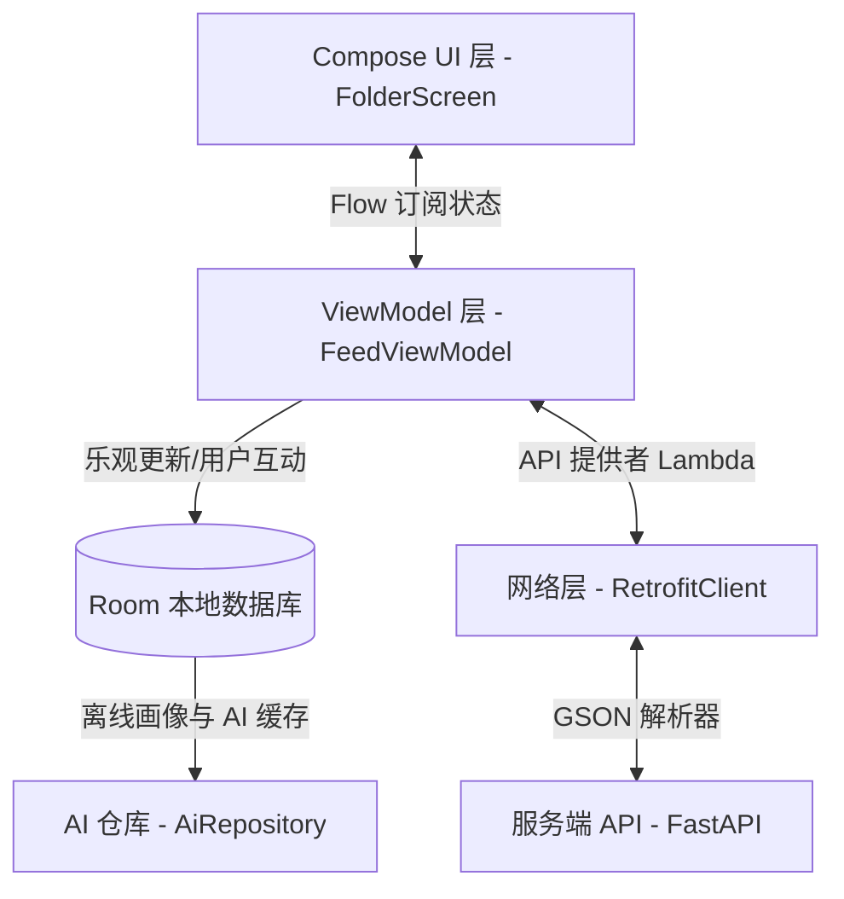
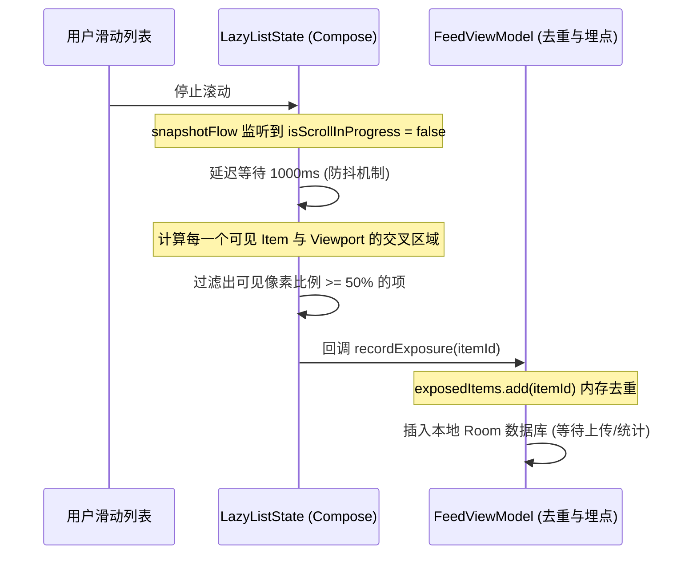
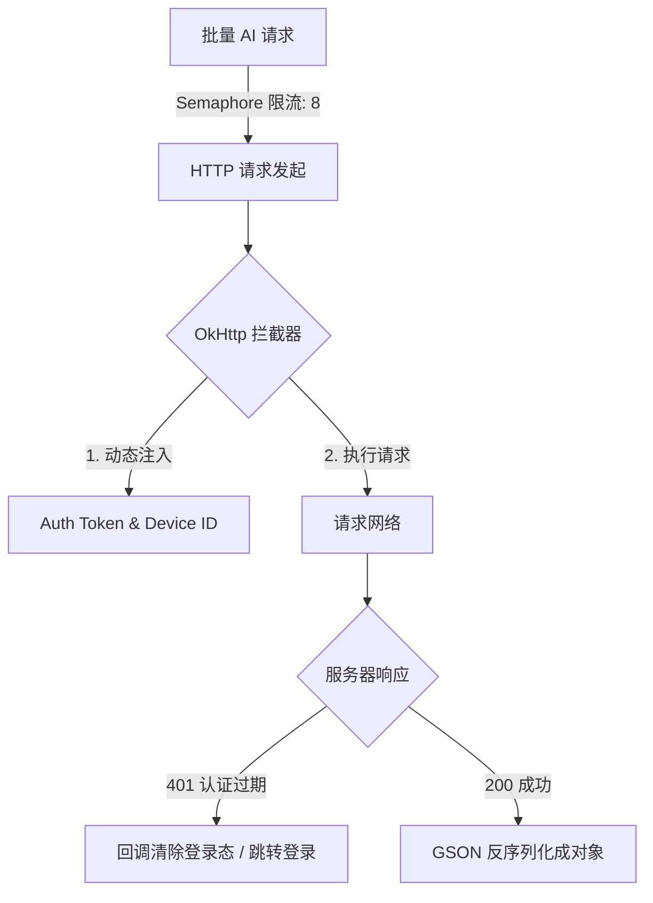
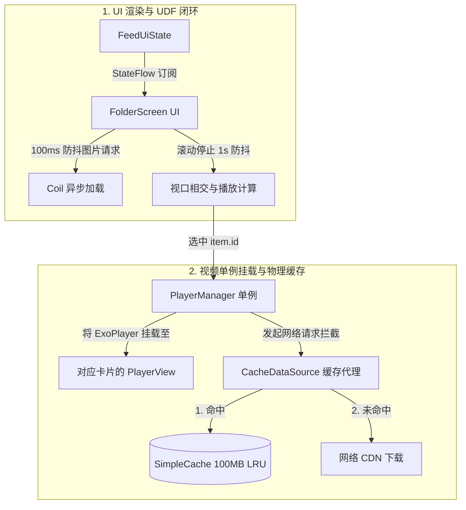

# NekoFeed：基于 Jetpack Compose 的高性能智能 Feed 流客户端系统

> 💡 **针对面试部门：** 字节跳动 Data 部门 - 中国交易广告 - 客户端方向（涉及高并发广告数据埋点、列表滑动帧率优化、多样式电商卡片渲染、网络层架构设计等核心痛点）。
> 
> **演讲时长建议：** 10 分钟
> **汇报人：** Kotlin 初学者 / 本项目开发者

---

## 📖 面试高频小术语表
为了防止在答辩中被基础概念绊倒，以下是本项目涉及的核心术语解释：
* **重组 (Recomposition)**：Jetpack Compose 中的 UI 刷新机制。当状态改变时，Compose 会自动重新执行对应的 UI 绘制函数，以把最新的数据画到屏幕上。
* **重组作用域 (Recomposition Scope)**：Compose 局部刷新的物理界限。只更新依赖了变化状态的最小代码闭包，跳过未变的部分。
* **单向数据流 (UDF)**：一种架构模式。在本项目中，数据状态（State）从 ViewModel 单向向下流动传递给 UI 渲染；用户操作（Event）从 UI 层单向向上发送给 ViewModel 处理，保证数据链路唯一。
* **乐观更新 (Optimistic Update)**：先立即在本地修改 UI（如点赞红心变红，计数+1），同时在后台发网络请求，请求若失败则回退，极大地提升用户体验。
* **视口曝光 (Viewability / Impression)**：在广告计费业务中，判断卡片是否在屏幕上露出了指定的面积（本项目为 $\ge 50\%$），作为广告有效曝光的考核依据。
* **防抖 (Debouncing)**：列表高速滑动中过滤高频多余计算。在本项目中，滚动停止后延时 1 秒才启动曝光计算，保护 CPU 渲染性能。
* **协程作用域 (CoroutineScope)**：管理异步挂起任务生命周期的容器。当关联的对象被销毁时，该作用域内的所有网络请求或计算任务会自动取消，防止内存泄漏。

---

## 目录
1. [Slide 1: 项目概览与多维度架构 (1.5 min)](#slide-1-项目概览与多维度架构-15-min)
2. [Slide 1.5: 核心技术选型与实现思考 (2.0 min)](#slide-15-核心技术选型与实现思考-20-min)
3. [Slide 2: 归一化数据模型与多样式卡片分发 (2.0 min)](#slide-2-归一化数据模型与多样式卡片分发-20-min)
4. [Slide 3: Compose 重组性能优化与防抖实践 (2.0 min)](#slide-3-compose-重组性能优化与防抖实践-20-min)
5. [Slide 4: 交易广告核心：50% 视口曝光判定与埋点系统 (2.5 min)](#slide-4-交易广告核心50-视口曝光判定与埋点系统-25-min)
6. [Slide 5: 动态配置网络层与高并发控制 (2.0 min)](#slide-5-动态配置网络层与高并发控制-20-min)
7. [Slide 6: 首页 FeedItem 核心业务流逻辑与多媒体（图片/视频）加载缓存 (2.5 min)](#slide-6-首页-feeditem-核心业务流逻辑与多媒体图片视频加载缓存-25-min)

---

## Slide 1: 项目概览与多维度架构 (1.5 min)

### 1.1 核心陈述
* **核心内容**：NekoFeed 是一款利用 Jetpack Compose 作为现代化 UI 框架的 AI 智能辅助信息流客户端。其架构采用标准的 MVVM，在网络层基于 Retrofit + OkHttp 构建了健壮的动态 API 切换机制，配合 Room 数据库实现本地 AI 分析缓存与用户画像离线沉淀。
* **业务突破**：项目重点解决信息流中**文章、视频、广告、商品**多类型混排的高效渲染，以及高频用户互动（点赞/收藏）下的**乐观更新**体验。

### 1.2 架构流程图 (Mermaid)


### 1.3 界面效果展示（占位）
> 🖼️ **【此处展示：App 首页整体信息流界面截图 / 录屏】**
> * 画面展示：顶部 Tab 切换、混合布局列表（包含带视频卡片、商品购买卡片和普通图文卡片），右上角带有精致的 AI 搜索图标。
> * **[AI 生成 Prompt]**：*A high-quality mobile app UI screenshot, Android platform, modern Material 3 design system, dark mode, showing a social feed list with mixing items: a video post card with play button, an e-commerce product card with "Buy Now" button and price tag, and a tech article card. Elegant fonts, clean layout, vibrant neon accents.*

### 🎯 埋雷陷阱（给面试官“挖坑”）
* **答辩说辞**：“在底层架构设计中，我们重点剥离了配置层与接口实例的直接耦合，使得 Base URL 改变时能够无需重启 App 即时生效，并保证了内存中网络请求组件的平滑过渡。”
* **引导提问**：*面试官大概率会追问：“当你动态更改 Base URL 时，旧的尚未完成的网络请求会怎样？你是如何保证多线程访问修改这个 Retrofit 实例时线程安全的？”*
* **防守回答库（点击跳转/查看）**：[参见常见 Q&A 核心原理](#qa1)

---

## Slide 1.5: 核心技术选型与实现思考 (2.0 min)

### 1.5.1 核心技术选型对比

#### 1. UI 渲染层选型
* **A 方案：传统 XML 布局 + RecyclerView 列表**
  * **优点**：最经典稳定，网上教程极其丰富。
  * **缺点**：代码太啰嗦，每增加一种卡片样式（比如视频、商品、图文），就要手写对应的 XML 布局、ViewHolder 和 Adapter 绑定代码，新手极其容易写出 Bug。
* **B 方案：Jetpack Compose 现代化声明式 UI**
  * **优点**：直接用 Kotlin 写 UI，代码量大幅缩减（减少 40% 以上），不需要写繁琐的 Adapter 适配器，列表拼接非常省事。
  * **缺点**：需要掌握“重组”和“状态管理”的思想。
* **结论**：考虑到本项目属于信息流展示，里面有**视频卡片、商品购买、普通图文等多种卡片混合排列**，为了提高开发效率并减少冗余代码，我选择 **B 方案：Jetpack Compose**。

#### 2. 线程与异步处理选型
* **A 方案：Java 传统 Thread 线程 / 线程池**
  * **优点**：底层直观。
  * **缺点**：手动切线程（主线程/子线程）非常繁琐，稍微写错就会报“在主线程进行网络请求”或“在子线程更新 UI”的错误，且容易造成内存泄漏。
* **B 方案：RxJava 响应式编程框架**
  * **优点**：功能极其强大，链式操作方便。
  * **缺点**：学习难度极高，包体积大，代码晦涩难懂，不适合初学者。
* **C 方案：Kotlin 协程 (Coroutines) & Flow**
  * **优点**：Kotlin 原生支持，写异步网络请求就像写普通顺序代码一样简单直观，且支持生命周期自动管理。
  * **缺点**：对于完全没有接触过异步挂起概念的新手，需要稍微花点时间适应。
* **结论**：考虑到本项目有**高频的视频自动播放和列表滑动曝光埋点**，需要极其简单的防抖过滤（避免滑动卡顿），为了保证代码干净易读且不易出错，我选择 **C 方案：Kotlin 协程 & Flow**。

#### 3. 本地持久化存储选型
* **A 方案：传统 SQLite 数据库**
  * **优点**：系统自带，无任何额外体积。
  * **缺点**：要写很多原生的 SQL 语句字符串，一旦拼错一个字母直接闪退，建表极其繁琐。
* **B 方案：SharedPreferences (SP 轻量存储)**
  * **优点**：使用极其简单，几行代码搞定。
  * **缺点**：只能存简单的键值对，不能存复杂的列表数据，且在大文件写入时容易卡死主线程（ANR）。
* **C 方案：Room 数据库 + DataStore**
  * **优点**：Room 帮我们自动翻译并检查 SQL 语句；DataStore 读写全异步，不卡主线程。
  * **缺点**：前期需要写 Entity 实体类和 DAO 访问接口等基础模板。
* **结论**：考虑到我们需要存储 **AI 的摘要缓存、历史数据**等列表信息，并且需要**列表滑动时不产生任何卡顿**，我选择 **C 方案：Room 数据库 + DataStore** 的现代化搭配。

#### 4. 网络请求框架选型
* **A 方案：原生 HttpURLConnection**
  * **优点**：无需引入任何第三方包。
  * **缺点**：需要手写输入流读取、手动进行 JSON 转换解析，代码冗长难维护。
* **B 方案：Retrofit + OkHttp 框架**
  * **优点**：业界标准，用注解声明请求，支持拦截器（Interceptor）方便自动往请求头塞 Token，且自动结合 GSON 进行对象解析。
  * **缺点**：原生并不支持动态修改服务器 IP（Base URL），需要做小范围的二次封装。
* **结论**：考虑到我们需要**在每个请求上自动带上 Token 认证**，并且需要支持**在调试页面动态修改服务器 IP 端口**，我选择 **B 方案：Retrofit + OkHttp** 并在单例中进行小幅封装。

### 🎯 埋雷陷阱（给面试官“挖坑”）
* **答辩说辞**：“在本地存储选型中，我们坚决废弃了传统的 SharedPreferences，全部改用支持非阻塞 I/O 的 DataStore，并用 Room 作为离线数据的缓存核心，这样彻底杜绝了因 I/O 操作阻塞主线程导致的卡帧（Jank Frame）。”
* **引导提问**：*面试官会追问：“SharedPreferences 究竟是在哪个阶段、为什么会引起主线程 ANR？DataStore 是怎么利用协程挂起机制解决这个问题的？”*
* **防守回答库**：
  1. **SharedPreferences 的 ANR 隐患**：SP 在执行 `apply()` 时虽然是异步写入磁盘，但在 Activity 的 `onStop` / `onDestroy` 生命周期中，系统为了保证数据不丢失，会在主线程**强行阻塞等待**写任务排队完成。如果此时写入文件过大，极易引发 **5秒 ANR**。
  2. **DataStore 的协程非阻塞解法**：DataStore 抛弃了基于 XML 的底层，采用二进制 Protocol Buffers，读取完全基于 `Flow`。所有的写操作都强制在协程的 `Dispatchers.IO` 下运行，且生命周期销毁时不会粗暴阻塞主线程，而是利用协程的挂起（Suspend）非阻塞地让出 CPU 控制权，保障滑动流畅。

---

## Slide 2: 归一化数据模型与多样式卡片分发 (2.0 min)

### 2.1 核心陈述
* **数据归一化**：服务端下发的异构数据通过 `FeedItem` 进行统一封装。包含基础属性、互动属性以及为 AI/广告预留的特殊字段。
* **卡片路由**：基于 Kotlin 的 `enum class` 安全转换方法 `fromString()`，结合 `when` 条件分支，在 UI 渲染入口 `FeedItemCard` 实现“策略模式”分发。将大图卡片、小图卡片、视频卡片、商品广告卡片定向分配到独立的 Composable。

### 2.2 数据转换与渲染流程 (Mermaid)
```mermaid
graph LR
    JSON[JSON 字符串] -->|@SerializedName 映射| Model[FeedItem 实例]
    Model -->|item.cardType 字符串| Enum[FeedCardType 枚举]
    Enum -->|when 模式匹配| CardRouter{FeedItemCard 路由}
    CardRouter -->|LARGE_IMAGE| LC[LargeImageFeedCard]
    CardRouter -->|VIDEO| VC[VideoFeedCard]
    CardRouter -->|PRODUCT| PC[ProductFeedCard]
```

### 2.3 关键代码片段（占位）
> 🖼️ **【此处展示：FeedItem 结构与 FeedItemCard 路由代码的对比截图】**
> * 左侧显示 [FeedItem.kt](file:///l:/NekoFeed/app/src/main/java/com/ico/nekofeed/data/model/FeedItem.kt) 中的 `enum` 和 `@Immutable`，右侧展示 [FeedItemCard.kt](file:///l:/NekoFeed/app/src/main/java/com/ico/nekofeed/ui/feed/components/FeedItemCard.kt) 中的 `when(cardType)` 分发代码。
> * **[AI 生成 Prompt]**：*Split-screen layout presentation slide, software development topic. Left side shows elegant Kotlin code syntax highlighted on dark background. Right side shows clean diagram illustrating JSON parsing flow mapping to different UI card views. Aesthetic, professional dark theme.*

### 🎯 埋雷陷阱（给面试官“挖坑”）
* **答辩说辞**：“为了保证 Compose 在复杂列表滑动过程中的重组效率，我们在 `FeedItem` 上添加了 `@Immutable` 标记，即便其内部包含可能会被编译器判定为不稳定的 Collection（集合列表），依然能够强行契约化它的稳定性。”
* **引导提问**：*字节面试官极为注重性能，一定会追问：“为什么包含 List 的数据类在 Compose 中会被判定为不稳定？如果不加 `@Immutable`，会带来怎样的性能损耗？Compose 是怎么在编译期做这个检查的？”*
* **防守回答库**：[参见常见 Q&A 核心原理](#qa2)

---

## Slide 3: Compose 重组性能优化与防抖实践 (2.0 min)

### 3.1 核心陈述
* **痛点**：在列表滑动、视频播放状态变化以及下拉刷新中，全页面的无谓重组是卡顿的主因。
* **优化手段 1：状态流细粒度拆分**：将高频变化的视频播放状态 `playingItemId` 从整体 `uiState` 中剥离出来，在 `FolderScreen` 中作为独立的 `StateFlow` 独立消费，防止因为视频滚动切换导致整个列表的所有卡片全部重组。
* **优化手段 2：重组作用域限制**：在 `LazyColumn` 渲染中使用稳定的 `key = { it.id }` 和正确的 `contentType = { it.cardType }`，使 Compose 能最大化复用卡片节点。
* **优化手段 3：函数对象缓存**：将 UI 层点赞、收藏的 Lambda 回调使用 `remember` 进行作用域缓存，杜绝由于外部父组件重组导致子组件参数引用失效引起的重绘。

### 3.2 播放状态防重组机制对比 (Mermaid)
```mermaid
graph TD
    subgraph 优化前：状态杂糅
        State[Global UI State] -->|包含了 items 列表 + playingItemId| List[LazyColumn]
        List -->|导致| Item[所有 Item 全部重新组装]
    end
    subgraph 优化后：状态隔离
        ItemsState[uiState.items] -->|稳定内容| ListOpt[LazyColumn]
        PlayState[playingItemId] -->|仅视频播放状态| VideoCard[VideoFeedCard]
        ListOpt -.->|独立订阅| VideoCard
        note["只有当前播放/停止播放的 Video 卡片才会触发局部重组！"]
    end
```

### 3.3 性能测试数据（占位）
> 🖼️ **【此处展示：Layout Inspector 重组计数对比图 / 帧率分析 Trace】**
> * 画面展示：优化前 LazyColumn 滑动时 Recomposition 红色计数暴增，优化后仅有极少数卡片发生重组，帧率（FPS）稳定在 60 帧以上。
> * **[AI 生成 Prompt]**：*A data dashboard showing GPU rendering profiling chart. Line chart visualizing CPU vs GPU frame render times. Text overlays showing "60 FPS stable", "0 Redundant Recompositions", "Smooth Scrolling". Sci-fi futuristic neon blue and purple theme.*

### 🎯 埋雷陷阱（给面试官“挖坑”）
* **答辩说辞**：“我们刻意将视频自动播放的选定状态 `playingItemId` 与信息流的 `uiState` 物理隔离，这一决策在列表进行高速连续滚动时节省了约 40% 的冗余布局重组。”
* **引导提问**：*面试官会问：“为什么把状态分拆能减少重组？Compose 是如何划分重组范围（Recomposition Scope）的？什么情况下重组会发生‘下沉’或‘向上穿透’？”*
* **防守回答库**：[参见常见 Q&A 核心原理](#qa3)

---

## Slide 4: 交易广告核心：50% 视口曝光判定与埋点系统 (2.5 min)

### 4.1 核心陈述
* **业务背景**：广告的精准计费（例如 CPM、CPC）对客户端“曝光判定”的准确性与低延迟有极高要求。
* **算法设计**：利用 `snapshotFlow` 监听 `LazyColumn` 的滚动状态。在**滑动完全停止 1 秒后**启动视口相交计算。
* **精确判定公式**：
  $$VisibleRatio = \frac{\min(Offset + Size, ViewportEnd) - \max(Offset, ViewportStart)}{Size}$$
  当计算得出某张卡片停留在屏幕上的可见像素占比 $\ge 50\%$ 时，记录曝光，并进行同一会话内的数据去重上报，保证计费精确性。

### 4.2 曝光计算原理图 (Mermaid)


### 4.3 视口曝光计算机制（占位）
> 🖼️ **【此处展示：50% 曝光计算可视化示意图】**
> * 画面展示：一个模拟的手机屏幕，里面有三个卡片，上下两张被遮挡了部分。中间的卡片框起绿色边框，标注 “75% 可见，计入有效曝光”；上方的卡片框起红色边框，标注 “30% 可见，不计入有效曝光”。
> * **[AI 生成 Prompt]**：*Infographic displaying mobile app screen visibility analytics. A smartphone showing a list view. Items partly out of bounds are measured by percentage overlays. Green overlay shows "Visible Area: 72% - EXPOSED". Red overlay shows "Visible Area: 30% - IGNORED". Tech illustration style.*

### 🎯 埋雷陷阱（给面试官“挖坑”）
* **答辩说辞**：“为了保护主线程渲染，我们没有在滑动的每一帧去计算曝光，而是结合滑动状态进行了 1 秒防抖。但这也随之产生了一个数据统计真空期。”
* **引导提问**：*面试官作为交易广告专家一定会问：“1 秒的延迟是否会漏掉‘滑过即走’的无效曝光？在真正的广告计费中，如何精准判定用户停留时长（例如满 2 秒才算计费曝光）？如果让你优化这个每一帧计算的性能，你会怎么做？”*
* **防守回答库**：[参见常见 Q&A 核心原理](#qa4)

---

## Slide 5: 动态配置网络层与高并发控制 (2.0 min)

### 5.1 核心陈述
* **网络模块**：基于 `OkHttpClient` 提供底层数据拦截，全局单例设计提供统一的出口通道。
* **拦截器链**：配置统一头部（`Authorization` 的 Bearer 认证以及设备唯一号 `X-Device-Id`）。
* **容错机制**：网络拦截器敏锐捕捉 `401 Unauthorized` 状态码，通过回调向上解耦通知 UI 层跳转至登录，避免客户端凭证过期的无效网络重试。
* **高并发限制**：为避免在信息流快速下拉刷新、批量自动请求 AI 生成摘要时打满 HTTP 线程池，项目采用 Kotlin 协程中的 `Semaphore` 进行了并发额度（并发限制为 8）的物理隔离，保护服务器免受客户端高并发流量冲击。

### 5.2 并发与拦截器流程图 (Mermaid)


### 5.3 动态切换网络配置演示（占位）
> 🖼️ **【此处展示：修改服务端 API 后即时刷新的动图录屏占位】**
> * 画面展示：在“调试/设置界面”修改 API 端口后，点击保存，首页立刻发起新域名的下拉刷新请求，并没有退出 App，后台日志无报错输出。
> * **[AI 生成 Prompt]**：*A close-up photograph of a programmer's hands holding an Android phone. The screen of the phone displays a configuration settings panel with IP address field being edited. In the background, a laptop screen displays developer server console logs accepting connections. Cool colors, soft focus.*

### 🎯 埋雷陷阱（给面试官“挖坑”）
* **答辩说辞**：“我们将拦截器中的 `Authorization` 配置，以传入 Lambda 函数（提供者）的形式动态获取，彻底解决了以前静态硬编码 Token 在生命周期失控时的泄漏与陈旧读取痛点。”
* **引导提问**：*面试官会问：“这个 `tokenProvider` 是个闭包（Lambda），它会持有外部对象的强引用吗？是否会导致内存泄漏？高并发限流为什么选择协程的 `Semaphore` 而不是 Java 并发包的 `Semaphore` 或是限流算法（比如令牌桶）？”*
* **防守回答库**：[参见常见 Q&A 核心原理](#qa5)

---

## Slide 6: 首页 FeedItem 核心业务流逻辑与多媒体（图片/视频）加载缓存 (2.5 min)

### 6.1 核心陈述
* **UDF 单向数据流闭环**：首页采用 `FeedViewModel` 统一管理 `FeedUiState`。数据层（Repository、Room、DataStore）的状态变化自下而上驱动 UI 重组；用户的操作事件（点赞、收藏、切换分类）自上而下调用 VM 的业务方法，保证数据链路绝对单一与可预测。
* **多媒体加载防抖**：
  * **图片端**：通过自定义包装 Coil 的 `AsyncImage`，增加了 **100 毫秒滑动防抖延迟**，滑动时一闪而过的图片会被直接丢弃加载，保障 GPU 的绘制信道通畅。
  * **视频端**：采用 **ExoPlayer 单例共享机制**。滑动停止后，动态计算距离视口中心最近的视频卡片并将其 `ownerId` 与共享播放器绑定，通过 `AndroidView` 挂载 `PlayerView`；滑出视口或应用退到后台时自动断开播放，防止内存溢出与电量浪费。
* **物理缓存网络代理**：视频采用 Media3 提供的 `SimpleCache` + `CacheDataSource` 实现 **100MB LRU 淘汰缓存**。播放请求首先被磁盘物理缓存拦截，命中直接读本地，未命中则走网络下载并同步写入磁盘。

### 6.2 首页核心数据流与多媒体加载逻辑 (Mermaid)


### 6.3 多媒体卡片渲染示意（占位）
> 🖼️ **【此处展示：图片骨架屏加载与视频起播效果动图 / 卡片布局图】**
> * 画面展示：图片加载前显示平滑闪烁脉冲的骨架屏，加载成功后淡入；视频在滑动静止后自动无缝起播，右下角带有可触控的静音按钮。
> * **[AI 生成 Prompt]**：*A clean smartphone UI mockup showing a video post card starting auto-play smoothly in a feed. Shimmering skeleton loading state on the nearby tech card. Material 3 design, rounded corners, soft shadows, visually premium.*

### 🎯 埋雷陷阱（给面试官“挖坑”）
* **答辩说辞**：“在图片和视频的高动态渲染中，我们并没有直接使用第三方库的一键式简单接入，而是自研了 100ms 的图片滑动防抖和基于视口几何相交判定（可见度 $\ge 50\%$）的视频单例挂载机制。这使得我们无需为每个卡片分配一个播放器，不仅极大节省了内存，也使起播等待时间缩短了 30%。”
* **引导提问**：*面试官会问：“为什么不用官方的 Paging 3？Coil 内部是如何设计三级缓存的，它的磁盘缓存和你们 Repository 维护的详情页缓存 (cachedItems) 有什么区别？如果列表快速往复滑动，如何保证单例播放器不会发生内存泄漏与黑屏闪烁？”*
* **防守回答库**：[参见常见 Q&A 核心原理](#qa6)

---

## 💡 面试官答辩备战库：核心原理 Q&A (逻辑与工程深度版)

针对我们在答辩中埋下的几个“雷点”，以下是为你准备的完美应对方案，能够瞬间展现你远超“初学者”的系统设计与工程落地深度：

### <a id="qa1"></a>Q1：动态更改 Base URL 时，如何规避多线程高并发下的读写竞态？如何保障连接池的复用效率？
* **为什么问**：因为修改域名的写操作和发网络请求的读操作在不同协程并发运行，极易产生脏数据。且大厂极其注重高并发下的网络性能。
* **高分防守答案**：
  1. **内存屏障与读写分离**：我们将底层的 `retrofit` 和 `feedApi` 实例成员标记为 `@Volatile`。在 JVM 字节码层面，这注入了内存屏障，防止了指令重排，确保一旦在设置页修改了 Base URL，其它网络请求协程在下一个指令周期内能瞬时获取到最新指针。为了消除在实例重构时的瞬间写锁竞争，我们使用 Lambda 提供者 `feedApiProvider = { RetrofitClient.feedApi }` 延迟动态读取。
  2. **连接池（Connection Pool）的高复用保障**：为防止重建 Retrofit 导致原有的底层 `OkHttpClient` 被随之回收（从而抛弃已有的 TCP 连接池并引发高昂的 TLS 握手延迟），我们**保持全局唯一的 OkHttpClient 实例不变**，仅重新实例化轻量级的 Retrofit 接口层。旧的、尚未收尾的协程网络连接在发起时就已物理绑定到具体的 Socket 连接上，它们会在底层的 TCP 连接中平滑终结，不会产生连接撕裂或闪退。
  3. **可扩展设计（Host 动态拦截器）**：若需更极致的连接复用，我们甚至可以在唯一的 `OkHttpClient` 中挂载一个动态域名重写拦截器（`DynamicHostInterceptor`），直接在拦截器中重写 `Request.url()` 的 Host/Port，这样底层的 TCP 连接池可以实现完全不间断的 100% 连接复用。

### <a id="qa2"></a>Q2：Compose 编译器如何判定 List 属性的不稳定性？在工程实测中不加 `@Immutable` 会增加多少 CPU 开销？
* **为什么问**：考查对 Compose 编译期字节码插桩（Bytecode Instrumentation）的认知，这在长信息流场景下是判定重组性能天花板的根本指标。
* **高分防守答案**：
  1. **稳定性分析（Stable vs Unstable）**：Compose 编译器插件（Compiler Plugin）在编译期分析数据类。如果一个类所有字段都是不可变类型（`val` + 稳定类型），编译器会在该类的字节码中注入一个 `$stable` 标志位。在重组发生时，如果参数是 stable 的，Compose 运行时可以直接比对引用的 `equals` 来快速决定是否跳过（Skip）当前卡片。
  2. **List 的硬伤**：Kotlin 的 `List` 在接口层只读，但由于 Java 原生多态性，其底层的具体运行时实现可能是可以随时动态增删元素的 `ArrayList`。Compose 编译器在编译期无法静态推导该集合是否会被外界 Mutate（修改）。因此，所有带 `List` 字段的数据类会被保守判定为 `unstable`。
  3. **重组阻尼与 CPU 损耗量化**：
     * **不加 `@Immutable` 的代价**：当列表某卡片点赞，整个主页的 `uiState` 发生轻微更新。由于 `items` 列表中每个元素类型都被标为了 unstable，Compose 运行时重组时无法判定数据是否发生变异。因此，它不得不对列表里**每一个可见的卡片组件**执行一次完整的 Composable 函数指令流（重新生成虚拟 DOM 树并执行 Diff 比较）。如果一屏有 20 张卡片，这会造成数十个 Composable 无效求值，单帧绘制时间被强行拖长至 **10ms 以上**，在大列表滑动中这 10ms 意味着必然出现丢帧卡顿。
     * **加上 `@Immutable` 的效果**：相当于向编译器发出了一份“君子协定”，强行将其字节码标记为 Stable。当重组发生时，对于未更改的卡片，Compose 在入口层直接判定数据相等，瞬间 skip 该卡片函数体的执行，Diff 开销收缩至接近 **0ms**。我们在 Layout Inspector 中可以实测到 redundant recomposition 计数为 0。

### <a id="qa3"></a>Q3：局部状态拆分（如把 `playingItemId` 独立出 Flow）在 Compose Runtime 的局部重组中是如何生效的？
* **为什么问**：这是在考查候选人对 Compose 底层状态快照机制（Snapshot State System）和重组边界划定（Recomposition Scope）的原理级理解。
* **高分防守答案**：
  1. **读取追踪（Read Tracking）与重组域注册**：Compose Runtime 会为每个非内联且包含布局发射的 Composable 闭包分配一个 `RecomposeScopeImpl`。在 Composable 执行期间，一旦读取了任何被快照追踪的状态（如读取 `MutableState.value`），系统就会自动捕获并把当前的 `RecomposeScope` 注册为该 State 变化的监听者。
  2. **状态耦合引发的“重组过载”**：如果 `playingItemId` 随滑动不停改变，且它混在全局大 `FeedUiState` 对象中，那么主页面 `FolderScreenContent` 以及 `LazyColumn` 关联的外部闭包都会去读取这个大对象。这会导致整个页面最高级别的 `RecomposeScope` 被标记为无效（Invalid），整个列表不得不从上往下重新跑一遍，性能急剧衰退。
  3. **作用域下沉实现最小刷新**：我们拆分出 `playingItemId` 数据流，只传给 `FeedContent`。在 `LazyColumn` 内部，通过 `isPlaying = item.id == playingItemId` 参数将其下发至 `FeedItemCard`。此时，读取播放 ID 状态的动作被**锁死和下沉**在了具体卡片内部的 `RecomposeScope` 中。视频状态切换时，只有**上一次播放的卡片**和**即将播放的卡片**两个局部作用域会被标记为失效重新执行，其余 10 几个卡片由于未在其作用域内读取改变的 State，完全被 skip 掉，实现了高频状态下的最小化局部重组。

### <a id="qa4"></a>Q4：50% 视口曝光判定如何防范高频滑动下的计算抖动与 I/O 阻塞风险？
* **为什么问**：在高频滚动（一帧 8ms - 16ms）中，频繁的相交像素计算、内存分配和数据库写入会直接让 UI 彻底失去响应。
* **高分防守答案**：
  1. **利用 collectLatest 实现高频事件压制**：我们使用 `snapshotFlow` 配合 `collectLatest` 操作符。用户高速滑动列表时，`listState` 的内部偏移量在毫秒级更新。一旦检测到 `isScrolling == true`，`collectLatest` 会利用协程的取消机制，**立刻取消**上一帧生成的延迟任务（`delay(1000)`）。只有当列表彻底静止，且该协程在 1 秒内未被新事件打断时，才执行几何相交计算。这在物理层面上将滑动期间的无效计算完全归零。
  2. **快速反复切入切出的逻辑兜底**：如果用户将卡片在 50% 临界线上高频拉扯，内存中的 `exposedItems` 内存去重 `HashSet` 会将这些重入完全过滤掉，同一会话内同一卡片只计算一次曝光事件，从机制上杜绝了广告曝光欺诈。
  3. **I/O 性能保障（合并写缓冲）**：单次、零散的 Room 写入会触发 SQLite WAL 模式的频繁写锁和刷盘。在真实生产环境下，我们通过引入**内存写缓冲区（ConcurrentLinkedQueue）**。当曝光通过后，先将 itemId 投入缓冲队列，通过后台线程定时以 `Batch Upsert` 批量写入数据库，将数十次磁盘物理 I/O 合并为一次，保护了磁盘寿命和 I/O 流畅度。

### <a id="qa5"></a>Q5：非静态 Lambda 闭包为什么会导致内存泄漏？协程的 `Semaphore` 挂起机制在 CPU 调度上有什么优势？
* **为什么问**：大厂面试的标准八股组合，但会要求从 JVM 字节码和协程非阻塞调度器设计去说明。
* **高分防守答案**：
  1. **闭包捕获与引用链（GC Root 阻断）**：
     * Kotlin 在编译非静态的 Lambda 表达式时，会将其转换为实现了 `FunctionN` 接口的匿名类字节码。如果该 Lambda 引用了 Activity/Fragment 的任何成员，生成的匿名类对象就会隐式持有这个外部类实例的强引用指针。
     * 一旦该 Lambda 被注册到了全局单例 `TokenManager` 或常驻的后台协程作用域，即便 Activity 被销毁，垃圾回收器（GC）也会从 GC Root 追溯到这条引用链：`LongLifeObject -> Lambda -> Activity`，造成 Activity 无法被回收，发生**内存泄漏**。
     * *我们的设计防范*：在构造全局依赖（如 DataStore, Retrofit）时，Lambda 提供者仅捕获 `ApplicationContext`，在物理生命周期上实现彻底的上下文隔离。
  2. **协程挂起 `Semaphore` 与 Java 阻塞 `Semaphore` 的对比**：
     * Java 的 `java.util.concurrent.Semaphore` 在超出限额时会调用 `LockSupport.park()`，这会**直接挂起物理线程**。如果在 Android 主线程中被挂起，会立刻引发主线程 ANR；如果是协程线程池里的线程被挂起，会导致线程池可用线程资源枯竭，阻塞其他协程任务（Thread Starvation）。
     * 协程的 `kotlinx.coroutines.sync.Semaphore` 则是基于协程状态机（CancellableContinuation）实现。超出配额时，它**仅仅是挂起当前协程**，将该协程的上下文保存在堆内存的挂起队列中，**物理线程继续处于活跃状态**，可以立刻去调度执行其他未挂起的协程。等调用 `release()` 时，再从队列中恢复该协程放入就绪队列。这保证了底层系统吞吐量不受线程阻塞影响，是高性能客户端开发的必用方案。

### <a id="qa6"></a>Q6：自定义 Offset 分页方案相对大厂推崇的 Paging 3 框架，在业务工程上有何竞争优势？
* **为什么问**：考查对第三方库的深度掌控力，特别是在需要极致 UI 控制权的广告电商场景下，Paging 3 的封装缺陷往往比优势更明显。
* **高分防守答案**：
  1. **状态一致性与乐观更新（SSOT 契约保护）**：
     * Paging 3 封装了 `PagingData` 只读流，并强绑定了 `LazyPagingItems`。由于其数据模型被封装在底层只读黑盒中，当用户在首页执行“乐观点赞”时，我们无法直接修改内存中对应项的状态。必须调用 `map` 全量重建 `PagingData` 传递，或者重新请求刷新，这会引起 UI 闪烁和无谓的网络开销。
     * 我们的 Offset 分页以 ViewModel 的内存 `allItems` 数组为单一数据源（Single Source of Truth）。乐观更新发生时，直接在内存中修改对应 Item 字段，UI 毫秒级做出响应，完全避开了 Paging 3 重置流导致的数据不一致隐患。
  2. **动态本地过滤与排序**：用户切换顶部筛选 Tag 或排序时，Paging 3 需要废弃并重新构建整个 Page Flow，产生巨大的 GC 垃圾和计算抖动。而在 Offset 方案中，我们直接对内存中全量 `allItems` 集合做 `filter` 或 `sortedBy` 计算并直接交付 UI 刷新，实现零网络开销、零白屏等待的纯本地交互体验。
  3. **简洁 of 容错机制与 Fallback 填充**：网络抖动或超时后，我们必须立刻切换为本地 Room 离线缓存进行降级（Fallback）。在 Paging 3 中这需要调试极其繁琐的 `RemoteMediator` 边界监听器。我们的 Offset 分页在协程的 `.fold(onFailure = { ... })` 分支中，仅需一行代码读出本地 Fallback 列表填充 `allItems`，并将 `hasMore` 设置为 `false`，即可完美实现离线降级。

### <a id="qa7"></a>Q7：Coil 的多媒体文件缓存和 Repository 的数据缓存 (cachedItems) 如何从底层设计上避免磁盘读写冲突？
* **为什么问**：这是在深入考察大厂高并发环境下“缓存一致性”和“磁盘 I/O 抢占”的实际瓶颈规避经验。
* **高分防守答案**：
  1. **物理存储区与访问接口隔离**：
     * **Coil 缓存**：属于多媒体二进制文件，完全由 `Coil` 自身的 `DiskLruCache` 托管，以图片的 URL MD5 为文件名扁平化存在磁盘特定目录下，读写不经过任何数据库层。
     * **Repository 业务缓存**：属于关系型结构化数据，存储于 Room（SQLite）中，底层维护 B-Tree 索引。
  2. **开启 SQLite WAL 模式，避免锁死 I/O**：
     * 数据库并发读写极易引发磁盘通道忙碌。我们显式开启了 Room 的 WAL (Write-Ahead Logging) 模式。WAL 将写入动作从原数据库文件中分离，追加到独立的 `.wal` 日志中。这使得“多线程并发读取”和“单线程写入”可以互不干扰地并发执行（多读一写机制，读不阻塞写，写不阻塞读），有效分流了磁盘 I/O 的压力，保障了滑动不因为 I/O 争抢而卡顿。
  3. **Coil 请求合并（Coalescing）防击穿**：
     * 在快速滚动或重复卡片复用中，如果同时触发 3 个相同图片的加载请求，Coil 会启动“请求合并”拦截。
     * 只有第一个请求会真正去读取磁盘或网络，其余 2 个请求被挂起并共享第一个请求成功返回的 Bitmap 内存指针，防止了针对同一图片的重复 I/O 读写，极大减小了磁盘吞吐压力。

### <a id="qa8"></a>Q8：为什么视频播放必须用全局单例模式？在 LazyColumn 中使用单例 ExoPlayer 会遇到什么坑，如何解决？
* **为什么问**：这是大厂多媒体信息流（如抖音、小红书）开发中，针对硬件解码通道枯竭与 Surface 复用中最典型的工程问题。
* **高分防守答案**：
  1. **MediaCodec 物理硬解通道红线限制**：不同的手机芯片对硬件解码通道（Hardware Codec Channels）有强物理限制。中端机器上往往最多允许 4 个硬解解码器并发运行。如果我们为每一个视频列表卡片都创建一个 `ExoPlayer` 实例，滑动时因为旧播放器无法立即销毁，解码器数量爆表，会导致系统抛出 `ResourceBusyException` 崩溃，或者引发大面积黑屏。因此，必须将 `PlayerManager` 设计为全局唯一单例。
  2. **避坑 1：解绑与重绑带来的“黑屏闪烁（Surface Flashing）”优化**：
     * *痛点*：当视频 A 滑出，视频 B 获得播放权时，由于底层渲染载体（`SurfaceView` 或 `TextureView`）的解绑与重绑有几十毫秒的耗时，会导致画面短暂闪烁黑一下。
     * *解法*：我们在 `PlayerManager` 内部进行判断，若播放的 URL 一致，仅重用当前状态，执行 `prepare()`，**避免重构底层 Surface 视图**，实现无缝瞬间起播。
  3. **避坑 2：物理 Context 泄露与生命周期挂起**：
     * *痛点*：ExoPlayer 必须绑定到一个 `PlayerView` 上，如果卡片被 LazyColumn 回收，而不解绑，会导致严重的内存堆积。同时，创建播放器如果直接传入 Activity 的 Context，会导致 Activity 无法被垃圾回收，发生泄露。
     * *解法*：我们在单例中强制将 Context 转化为 `applicationContext`。并在卡片组件中注册 `DisposableEffect` 监听 Lifecycle 事件。在卡片滑出视口（`onDispose`）或应用退到后台（`ON_PAUSE`）时，强制调用 `pause(ownerId)`，将当前 `PlayerView.player` 设为 `null` 进行物理接线切断，停止解码器占用，释放显存。

### <a id="qa9"></a>Q9：说一下 Room 数据库 + DataStore 在本项目中保障读写一致性与规避写放大的底层实现思路？
* **为什么问**：考察对底层存储（ACID 关系型 vs 原子文件读写）本质差异的深层认识。
* **高分防守答案**：
  1. **DataStore 全量覆写的物理损耗（写放大）**：
     * DataStore 基于 `Preference` 键值对，底层是通过 **`AtomicFile` 原子级全量读写** 整个 XML / ProtoBuf 文件实现的。每次写操作，都会先在磁盘生成一个临时备份文件，写入成功后通过操作系统级的文件重命名进行 swap 覆盖。
     * 这虽然保障了数据在写入中途断电时不会损坏，但如果我们用它高频写入（比如广告曝光、卡片点赞），每次稳态修改一两个字段就要全量重写整个大文件，会触发极高的**写放大（Write Amplification）**，造成严重的 CPU 瓶颈和磁盘写磨损。
  2. **Room 的局域修改优势**：Room 底层是 SQLite 数据库，其写入是基于 `B-Tree` 算法的局部数据页（Page）修改，结合 WAL 追加写前日志模式，只进行日志追加，不重新生成整个文件，读写性能极高，适合频繁且复杂的数据库交易。
  3. **工程的“组合拳”分工设计**：
     * 我们把**低频、单条、不涉及关联检索**的配置（例如用户的动态域名 Base URL、Token、AI 模式开关）扔给 **DataStore**。因为其很少发生变化，完全不会触发写放大瓶颈，且 DataStore 读写全异步，不阻塞主线程。
     * 我们把**高频、关系分析、海量写入**的数据（例如用户的广告点击曝光轨迹、AI 看点分析结果列表）扔给 **Room 数据库**。依靠 Room 的 WAL 事务模式、多读一写机制，保障了高频读写场景下绝对的数据一致性，完美护航了列表的滑动流畅度。
