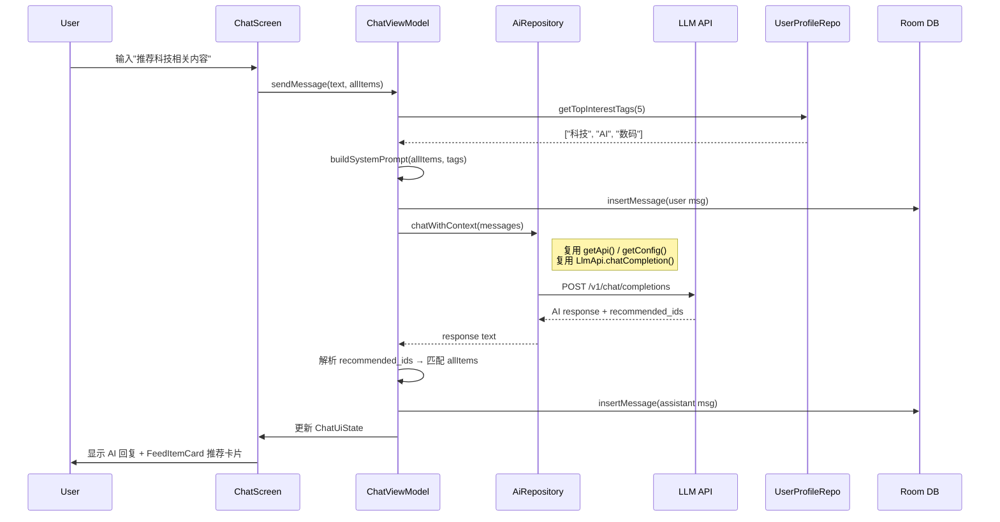

# LLM 对话助手 — 替换 NavigationBar 搜索项

## 背景

当前 NekoFeed 底部导航栏有 4 个 Tab：首页 / **搜索** / 统计 / 我的。现有的搜索页是一个"输入关键词 → LLM 解析意图 → 过滤 feed 列表"的单轮搜索流程。

**目标**：将底部导航栏的"搜索"Tab 替换为"AI 助手"Tab，实现一个**多轮对话式 LLM 聊天助手**，具备以下能力：

1. **看到用户画像**：系统 prompt 注入用户的兴趣标签、点赞/收藏偏好
2. **Feed 上下文感知**：系统 prompt 注入当前 feed 列表摘要，让 AI 了解有哪些内容可推荐
3. **个性化推荐**：用户可自然语言询问"推荐一些 XX"，AI 从当前 feed 中筛选并以卡片形式展示
4. **通用对话**：也可以闲聊、咨询等，不限于推荐功能

---

## User Review Required

> [!IMPORTANT]
> **导航变更**：底部导航栏的"搜索"入口将被替换为"AI 助手"。原有搜索功能可通过 FeedScreen 顶部的搜索图标 + AI 搜索条继续访问（这些入口保持不变）。是否接受？

> [!IMPORTANT]
> **对话历史持久化**：计划用 Room 存储聊天记录（本地），用户重新进入可以看到历史对话。清空功能由用户手动触发。是否需要这个功能？如不需要可简化为纯内存对话。

> [!WARNING]
> **Feed 上下文注入量**：系统 prompt 会包含当前 feed 列表的摘要信息（标题 + 标签，约 20 条），这会增加每次 LLM 调用的 token 消耗。建议限制为最多 20 条最近的 feed 摘要。

---

## Open Questions

1. **对话历史保留策略**：聊天记录仅保存在本地 Room 中？还是不需要持久化，每次打开都是新对话？
2. **推荐卡片交互**：当 AI 推荐 feed 时，返回的卡片是否可以点击跳转到详情页？（计划实现为可点击）
3. **助手的图标/名称**：底部导航栏的 label 用"AI"还是"助手"？图标用 `SmartToy` 还是 `AutoAwesome`？

---

## 已有 LLM 基础设施复用

本方案**充分复用**已有的 LLM 通信链路，不引入新的网络层代码：

| 已有模块 | 复用方式 | 是否修改 |
|----------|----------|----------|
| [LlmApi.kt](file:///l:/NekoFeed/app/src/main/java/com/ico/nekofeed/data/remote/LlmApi.kt) | `chatCompletion()` — 多轮对话只需传更长的 messages 列表 | ❌ 不修改 |
| [LlmClientFactory.kt](file:///l:/NekoFeed/app/src/main/java/com/ico/nekofeed/data/remote/LlmClientFactory.kt) | 动态构建 Retrofit 客户端 | ❌ 不修改 |
| [ChatRequest / ChatMessage / ChatResponse](file:///l:/NekoFeed/app/src/main/java/com/ico/nekofeed/data/remote/LlmApi.kt#L15-L38) | 数据类天然支持多轮（`messages: List<ChatMessage>`） | ❌ 不修改 |
| [TokenManager.getLlmConfig()](file:///l:/NekoFeed/app/src/main/java/com/ico/nekofeed/data/local/TokenManager.kt#L101-L103) | 读取 baseUrl / model / apiKey | ❌ 不修改 |
| [UserProfileRepository](file:///l:/NekoFeed/app/src/main/java/com/ico/nekofeed/data/repository/UserProfileRepository.kt) | `getTopInterestTags()` 注入系统 prompt | ❌ 不修改 |
| [AiRepository.kt](file:///l:/NekoFeed/app/src/main/java/com/ico/nekofeed/data/repository/AiRepository.kt) | 复用 `getApi()` / `getConfig()` 内部方法 | ✅ 仅新增 `chatWithContext()` |

---

## 现状分析

| 模块 | 现状 | 变更 |
|------|------|------|
| [BottomNavigationBar.kt](file:///l:/NekoFeed/app/src/main/java/com/ico/nekofeed/ui/components/BottomNavigationBar.kt) | 4 个 Tab: Home / **Search** / Stats / Profile | Search → **AI** |
| [SearchScreen.kt](file:///l:/NekoFeed/app/src/main/java/com/ico/nekofeed/ui/search/SearchScreen.kt) | 单轮搜索 UI | 保留但不再从 BottomNav 进入 |
| [AppNavHost.kt](file:///l:/NekoFeed/app/src/main/java/com/ico/nekofeed/navigation/AppNavHost.kt) | `search` 路由在嵌套导航中 | 新增 `chat` 路由替换 |
| [AiRepository.kt](file:///l:/NekoFeed/app/src/main/java/com/ico/nekofeed/data/repository/AiRepository.kt) | 有 `parseSearchQuery`、`generateFeedAi` | 新增 `chatWithContext()` |
| Room DB | 有 `AiCacheEntity`、`UserProfileEntity` | 新增 `ChatMessageEntity` |

---

## Proposed Changes

### Component 1 — 底部导航栏变更

#### [MODIFY] [BottomNavigationBar.kt](file:///l:/NekoFeed/app/src/main/java/com/ico/nekofeed/ui/components/BottomNavigationBar.kt)

将 `BottomNavItem.Search` 替换为 `BottomNavItem.Chat`：

```diff
- data object Search : BottomNavItem(
-     route = "search",
-     label = "搜索",
-     selectedIcon = Icons.Filled.Search,
-     unselectedIcon = Icons.Outlined.Search
- )
+ data object Chat : BottomNavItem(
+     route = "chat",
+     label = "AI",
+     selectedIcon = Icons.Filled.AutoAwesome,
+     unselectedIcon = Icons.Outlined.AutoAwesome
+ )
```

`bottomNavItems` 列表中 `BottomNavItem.Search` → `BottomNavItem.Chat`。

---

### Component 2 — 聊天 UI 层（MD3 Expressive）

#### [NEW] `ui/chat/ChatScreen.kt`

> [!IMPORTANT]
> 全面采用 **MD3 Expressive** 设计语言，与 App 现有页面风格完全一致。

**设计规范对照**（从现有代码提取的 MD3 Expressive 模式）：

| 设计元素 | 对应现有组件/模式 | ChatScreen 中的应用 |
|----------|-------------------|---------------------|
| `@OptIn(ExperimentalMaterial3ExpressiveApi::class)` | 所有 Screen 都使用 | ChatScreen 顶层标注 |
| `LoadingIndicator` | [AiSettingsScreen](file:///l:/NekoFeed/app/src/main/java/com/ico/nekofeed/ui/settings/AiSettingsScreen.kt#L188) / [FolderScreen](file:///l:/NekoFeed/app/src/main/java/com/ico/nekofeed/ui/feed/FolderScreen.kt#L517) | AI 正在思考时显示 |
| `LinearWavyProgressIndicator` | [LargeImageFeedCard](file:///l:/NekoFeed/app/src/main/java/com/ico/nekofeed/ui/feed/components/LargeImageFeedCard.kt#L213) AI 加载动画 | 打字中的波浪进度条 |
| `ExpressiveTokens.SplitButtonOuterCorner` (20.dp) | [AiSettingsScreen](file:///l:/NekoFeed/app/src/main/java/com/ico/nekofeed/ui/settings/AiSettingsScreen.kt#L185) 按钮圆角 | 发送按钮圆角 |
| `Card + surfaceVariant.copy(alpha = 0.5f)` | [AiSettingsScreen](file:///l:/NekoFeed/app/src/main/java/com/ico/nekofeed/ui/settings/AiSettingsScreen.kt#L113) 卡片背景 | AI 消息气泡背景 |
| `primaryContainer.copy(alpha = 0.52f)` | [LargeImageFeedCard](file:///l:/NekoFeed/app/src/main/java/com/ico/nekofeed/ui/feed/components/LargeImageFeedCard.kt#L147) AI 摘要块 | AI 推荐内容高亮区域 |
| `primaryContainer.copy(alpha = 0.12f)` | [FolderScreen AISearchBar](file:///l:/NekoFeed/app/src/main/java/com/ico/nekofeed/ui/feed/FolderScreen.kt#L293) | 快捷建议芯片背景 |
| `AssistChip + RoundedCornerShape(20.dp)` | [FeedTagChip](file:///l:/NekoFeed/app/src/main/java/com/ico/nekofeed/ui/feed/components/FeedTagChip.kt) | 快捷建议标签 |
| `Crossfade` 过渡动画 | [LargeImageFeedCard](file:///l:/NekoFeed/app/src/main/java/com/ico/nekofeed/ui/feed/components/LargeImageFeedCard.kt#L137) | AI 回复出现动画 |
| `TopAppBar + surface containerColor` | 所有 Screen | 顶部栏 |
| `FeedItemCard` 组件 | 已有 Feed 卡片组件 | 推荐内容直接复用 |

**UI 结构详图**（含 MD3 Expressive 组件标注）：

```
┌──────────────────────────────────────┐
│ TopAppBar (surface containerColor)   │
│ ← AI 助手  ✨               [清空]  │
├──────────────────────────────────────┤
│ LazyColumn (reverseLayout = true)    │
│                                      │
│ ┌─ Card(surfaceVariant α0.5f) ─────┐ │ ← AI 气泡 (左对齐)
│ │ ✨ 你好！我是 NekoFeed AI 助手    │ │
│ │ 可以帮你推荐感兴趣的内容，        │ │
│ │ 聊天或回答问题 😊                 │ │
│ └──────────────────────────────────┘ │
│                                      │
│    ┌─ Card(primaryContainer α0.12f)─┐│ ← 用户气泡 (右对齐)
│    │ 推荐几个科技新闻               ││
│    └────────────────────────────────┘│
│                                      │
│ ┌─ Card(surfaceVariant α0.5f) ─────┐ │ ← AI 回复气泡
│ │ 根据你对科技和 AI 的兴趣，       │ │
│ │ 为你推荐这些内容：                │ │
│ │                                   │ │
│ │ ┌─ primaryContainer α0.52f ─────┐ │ │ ← 推荐高亮区域
│ │ │ ┌──────────────────────────┐  │ │ │
│ │ │ │ FeedItemCard (复用)      │  │ │ │ ← 可点击跳转
│ │ │ │ 📰 GPT-5 发布 | AI      │  │ │ │
│ │ │ └──────────────────────────┘  │ │ │
│ │ │ ┌──────────────────────────┐  │ │ │
│ │ │ │ FeedItemCard (复用)      │  │ │ │
│ │ │ │ 📰 Apple WWDC | 科技    │  │ │ │
│ │ │ └──────────────────────────┘  │ │ │
│ │ └───────────────────────────────┘ │ │
│ └──────────────────────────────────┘ │
│                                      │
│ ┌─ AI 思考中 ─────────────────────┐  │ ← Crossfade 过渡
│ │ LoadingIndicator                 │  │
│ │ LinearWavyProgressIndicator      │  │ ← 波浪进度条
│ │ "Neko 正在思考..."               │  │
│ └──────────────────────────────────┘  │
│                                      │
│ ┌─ 快捷建议 (首次/空对话时) ──────┐  │
│ │ AssistChip: 推荐科技  今日热门   │  │ ← FeedTagChip 风格
│ │ AssistChip: 本地生活  视频推荐   │  │
│ └──────────────────────────────────┘  │
├──────────────────────────────────────┤
│ Row (输入栏)                         │
│ ┌──────────────────────────┐ ┌────┐ │
│ │ OutlinedTextField        │ │发送│ │ ← Button(SplitButtonOuterCorner)
│ │ "有什么想聊的..."        │ │ ➤  │ │
│ └──────────────────────────┘ └────┘ │
└──────────────────────────────────────┘
```

**关键 MD3 Expressive 实现要点**：

1. **AI 思考动画** — 使用 `LinearWavyProgressIndicator`（与 Feed 卡片 AI 加载一致）：
   ```kotlin
   @OptIn(ExperimentalMaterial3ExpressiveApi::class)
   LinearWavyProgressIndicator(
       modifier = Modifier.fillMaxWidth().height(4.dp),
       color = MaterialTheme.colorScheme.primary,
       trackColor = MaterialTheme.colorScheme.primaryContainer.copy(alpha = 0.4f)
   )
   ```

2. **发送按钮** — 使用 `ExpressiveTokens.SplitButtonOuterCorner` 圆角：
   ```kotlin
   Button(
       onClick = onSend,
       shape = RoundedCornerShape(ExpressiveTokens.SplitButtonOuterCorner),
       // ...
   )
   ```

3. **AI 气泡内推荐卡片** — 直接复用 `FeedItemCard` 组件，嵌套在 `primaryContainer.copy(alpha = 0.52f)` 背景中

4. **快捷建议** — 复用 `AssistChip` 风格（`primaryContainer α0.12f` + `RoundedCornerShape(20.dp)`）

5. **页面加载** — `LoadingIndicator`（与 FeedScreen / AiSettingsScreen 一致）

6. **动画过渡** — `Crossfade` + `AnimatedVisibility` + `fadeIn` / `slideInVertically`（与 SearchScreen 一致）

#### [NEW] `ui/chat/ChatViewModel.kt`

```kotlin
@OptIn(ExperimentalMaterial3ExpressiveApi::class)
class ChatViewModel(application: Application) : AndroidViewModel(application) {
    // 依赖 — 全部复用已有实例
    private val tokenManager = TokenManager(application)
    private val database = NekoFeedDatabase.getInstance(application)
    private val aiRepository = AiRepository(tokenManager, database.aiCacheDao())  // 复用
    private val userProfileRepository = UserProfileRepository(database.userProfileDao())  // 复用
    private val chatMessageDao = database.chatMessageDao()  // 新增

    // 状态
    private val _uiState = MutableStateFlow(ChatUiState())
    val uiState: StateFlow<ChatUiState> = _uiState.asStateFlow()

    // 对话历史（含 system prompt，发给 LLM 用）
    private val conversationHistory = mutableListOf<ChatMessage>()

    init { loadHistory() }

    fun sendMessage(text: String, allItems: List<FeedItem>) {
        // 1. 添加用户消息到 UI
        // 2. 构建 system prompt（注入画像 + feed 上下文）
        // 3. 调用 aiRepository.chatWithContext(conversationHistory)
        // 4. 解析返回中的 recommended_ids → 匹配 allItems
        // 5. 添加 AI 回复到 UI（含推荐卡片）
        // 6. 持久化到 Room
    }

    private suspend fun buildSystemPrompt(
        allItems: List<FeedItem>,
        userTags: List<String>
    ): String {
        // 构建包含用户画像 + feed 摘要的系统 prompt
        // 详见下方 "Prompt 设计" 部分
    }

    fun clearChat() { /* 清空 Room + UI */ }
    private fun loadHistory() { /* 从 Room 加载历史 */ }
}
```

---

### Component 3 — 数据层扩展

#### [NEW] `data/local/db/ChatMessageEntity.kt`

```kotlin
@Entity(tableName = "chat_messages")
data class ChatMessageEntity(
    @PrimaryKey(autoGenerate = true) val id: Long = 0,
    val role: String,               // "user", "assistant"
    val content: String,
    val recommendedIds: String? = null,  // JSON array: ["id1", "id2"]
    val timestamp: Long = System.currentTimeMillis()
)
```

#### [NEW] `data/local/db/ChatMessageDao.kt`

```kotlin
@Dao
interface ChatMessageDao {
    @Query("SELECT * FROM chat_messages ORDER BY timestamp ASC")
    suspend fun getAllMessages(): List<ChatMessageEntity>

    @Insert
    suspend fun insertMessage(message: ChatMessageEntity): Long

    @Query("DELETE FROM chat_messages")
    suspend fun clearAll()

    @Query("SELECT COUNT(*) FROM chat_messages")
    suspend fun getMessageCount(): Int
}
```

#### [MODIFY] [NekoFeedDatabase.kt](file:///l:/NekoFeed/app/src/main/java/com/ico/nekofeed/data/local/db/NekoFeedDatabase.kt)

- 新增 `ChatMessageEntity` 到 `@Database entities` 数组
- 新增 `abstract fun chatMessageDao(): ChatMessageDao`
- 数据库版本 +1，添加 `fallbackToDestructiveMigration`（或手动 migration `ALTER TABLE`）

#### [MODIFY] [AiRepository.kt](file:///l:/NekoFeed/app/src/main/java/com/ico/nekofeed/data/repository/AiRepository.kt)

仅新增一个方法（**复用** `getApi()` 和 `getConfig()`）：

```kotlin
/**
 * 多轮对话接口 — 复用已有的 LlmApi.chatCompletion()
 * 与 parseSearchQuery / generateFeedAi 使用相同的底层 API 客户端
 */
suspend fun chatWithContext(messages: List<ChatMessage>): String? {
    val config = getConfig()
    val api = getApi() ?: return null

    val request = ChatRequest(
        model = config.model,
        messages = messages,       // 完整对话历史（含 system prompt）
        max_tokens = 1024,         // 对话需要更长回复
        temperature = 0.7f         // 对话场景温度略高
    )

    val auth = if (config.apiKey.isNotBlank()) "Bearer ${config.apiKey}" else ""
    return try {
        val response = api.chatCompletion(auth, request)
        response.choices.firstOrNull()?.message?.content
    } catch (e: Exception) {
        e.printStackTrace()
        null
    }
}
```

---

### Component 4 — UI 状态定义

#### [MODIFY] [UiState.kt](file:///l:/NekoFeed/app/src/main/java/com/ico/nekofeed/util/UiState.kt)

新增：

```kotlin
data class ChatUiState(
    val messages: List<ChatBubble> = emptyList(),
    val isAiTyping: Boolean = false,
    val errorMessage: String? = null
)

data class ChatBubble(
    val id: Long = 0,
    val role: String,                  // "user" or "assistant"
    val content: String,
    val recommendedItems: List<FeedItem> = emptyList(),
    val timestamp: Long = System.currentTimeMillis()
)
```

---

### Component 5 — 导航层更新

#### [MODIFY] [AppNavHost.kt](file:///l:/NekoFeed/app/src/main/java/com/ico/nekofeed/navigation/AppNavHost.kt)

在 `MainScreen` 的嵌套 NavHost 中新增 `chat` 路由（`search` 路由保留不删除）：

```kotlin
composable("chat") {
    val chatViewModel: ChatViewModel = viewModel()
    ChatScreen(
        chatViewModel = chatViewModel,
        allItems = feedViewModel.getAllItems(),
        onItemClick = { itemId ->
            val encodedId = Uri.encode(itemId)
            nestedNavController.navigate("detail/$encodedId")
        }
    )
}
```

---

### Component 6 — Prompt 设计

**System Prompt 模板**（由 `ChatViewModel.buildSystemPrompt()` 构建）：

```
你是 NekoFeed 的 AI 助手「Neko」🐱。你可以：
1. 根据用户兴趣推荐信息流内容
2. 回答用户关于内容的问题
3. 进行友好的日常对话

---
【用户画像】
兴趣标签（按偏好排序）：{topTags.joinToString("、")}

---
【当前可推荐内容】（共 {count} 条）
{allItems.take(20).mapIndexed { i, item ->
    "${i+1}. [ID:${item.id}] ${item.title} | 标签：${item.displayTags.joinToString(",")} | 类型：${item.itemType}"
}.joinToString("\n")}

---
【回复规则】
- 使用中文回复，语气友好自然
- 当用户请求推荐内容时，从【当前可推荐内容】中选择最匹配的
- 推荐时在回复末尾追加一行 JSON：{"recommended_ids":["id1","id2",...]}
- 推荐 3~5 条最相关的内容，并简要说明推荐理由
- 如果没有匹配的内容，坦诚告知
- 非推荐请求则正常对话，不需要 JSON
```

---

## 整体数据流



---

## 文件变更总览

| 操作 | 文件 | 说明 |
|------|------|------|
| **MODIFY** | `ui/components/BottomNavigationBar.kt` | Search → Chat |
| **NEW** | `ui/chat/ChatScreen.kt` | 对话 UI — MD3 Expressive 全套 |
| **NEW** | `ui/chat/ChatViewModel.kt` | 对话逻辑 + system prompt |
| **NEW** | `data/local/db/ChatMessageEntity.kt` | 聊天记录 Entity |
| **NEW** | `data/local/db/ChatMessageDao.kt` | 聊天记录 DAO |
| **MODIFY** | `data/local/db/NekoFeedDatabase.kt` | 新增 ChatMessage 表 |
| **MODIFY** | `data/repository/AiRepository.kt` | 新增 `chatWithContext()` （复用已有 LLM 基础设施） |
| **MODIFY** | `util/UiState.kt` | 新增 `ChatUiState` / `ChatBubble` |
| **MODIFY** | `navigation/AppNavHost.kt` | 新增 `chat` 路由 |

---

## Verification Plan

### 构建验证
```bash
./gradlew assembleDebug
```

### 手动验证
1. **导航栏**：底部导航栏显示 ✨ "AI" 图标（AutoAwesome），点击进入聊天界面
2. **视觉一致性**：ChatScreen 的卡片、颜色、圆角、动画与 FeedScreen / AiSettingsScreen 风格一致
3. **AI 思考动画**：发送消息后显示 `LinearWavyProgressIndicator` 波浪进度条
4. **推荐卡片**：AI 回复中的推荐内容以 `FeedItemCard` 形式展示，可点击跳转详情
5. **对话上下文**：连续发送多条消息，AI 能记住上下文
6. **搜索入口**：从 FeedScreen 顶部搜索图标仍可进入原搜索页
7. **降级场景**：AI 不可用时，显示友好错误提示
8. **清空对话**：点击清空按钮，对话历史被清除
