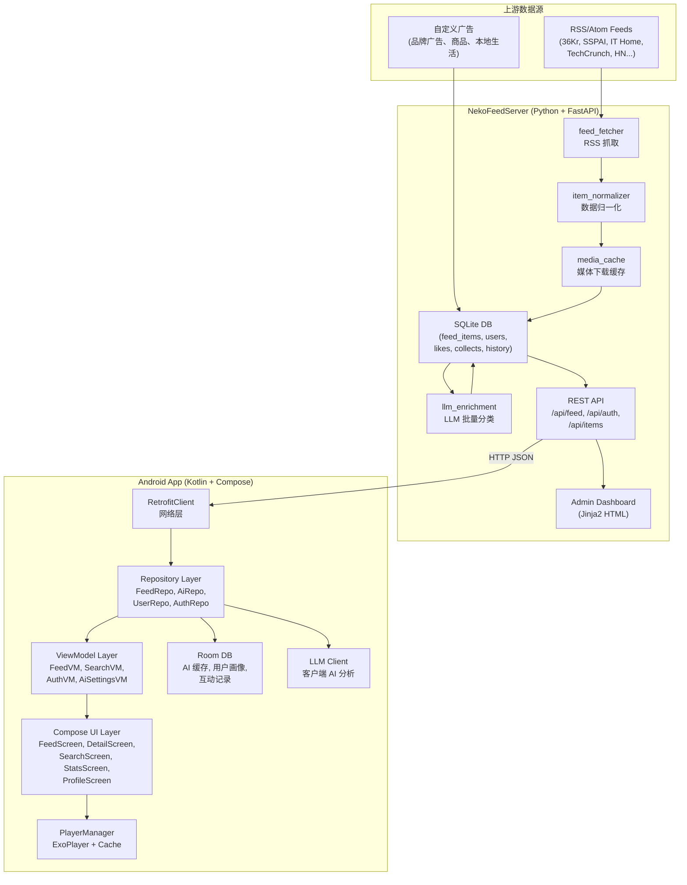
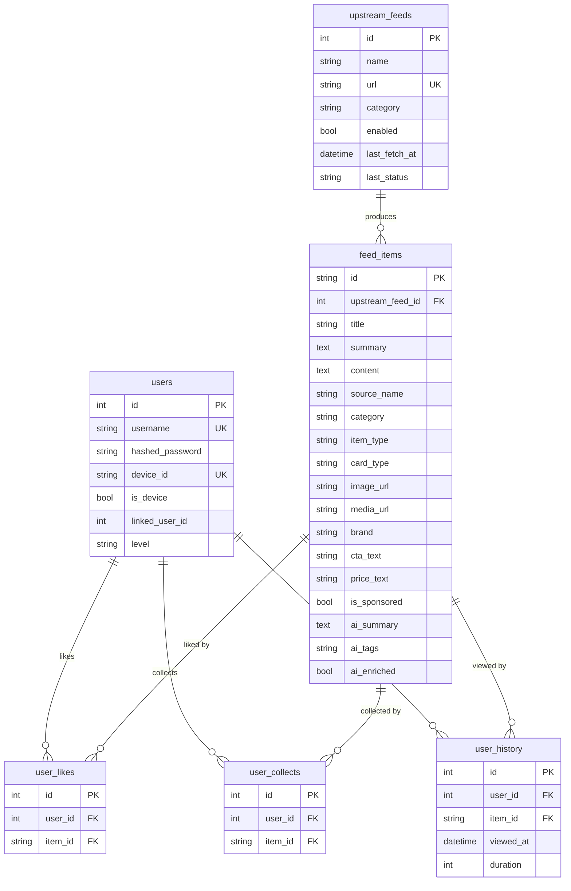
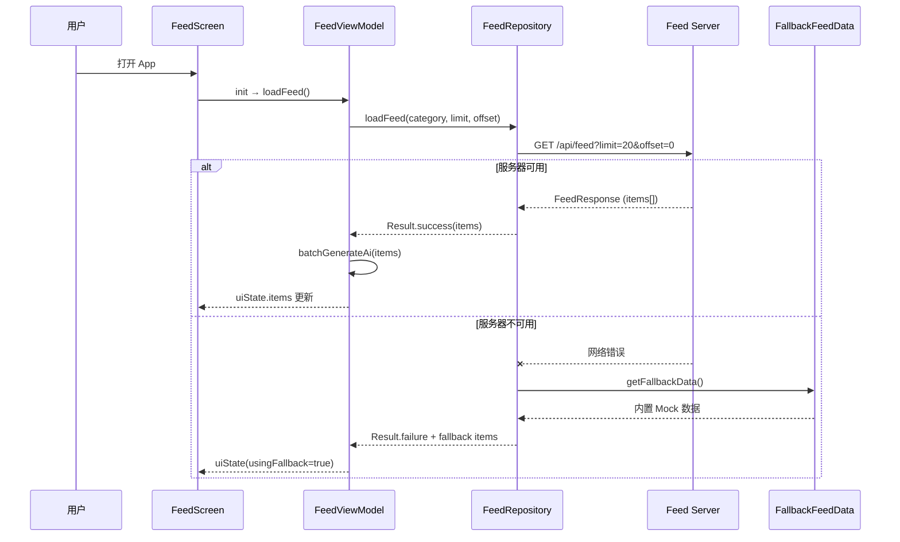
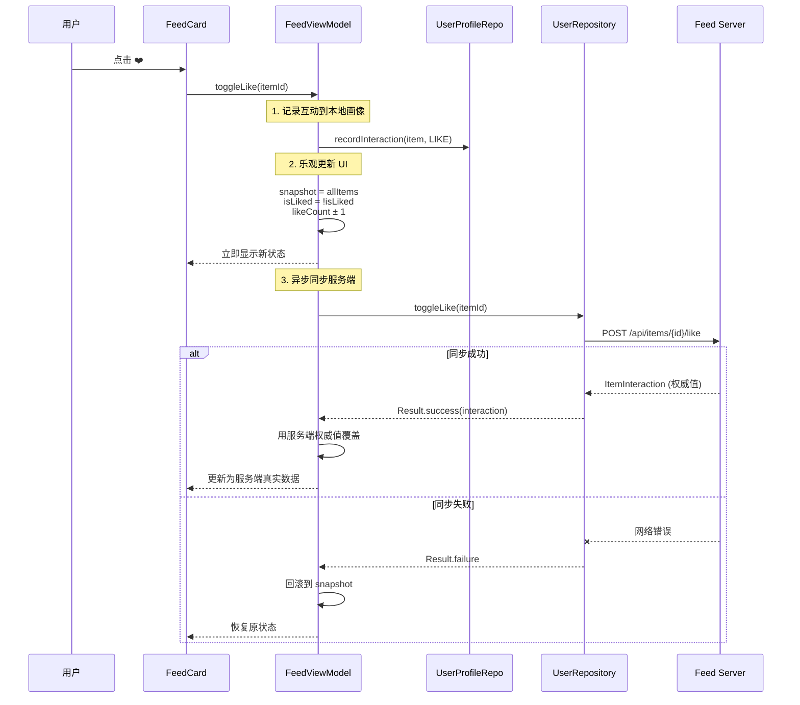
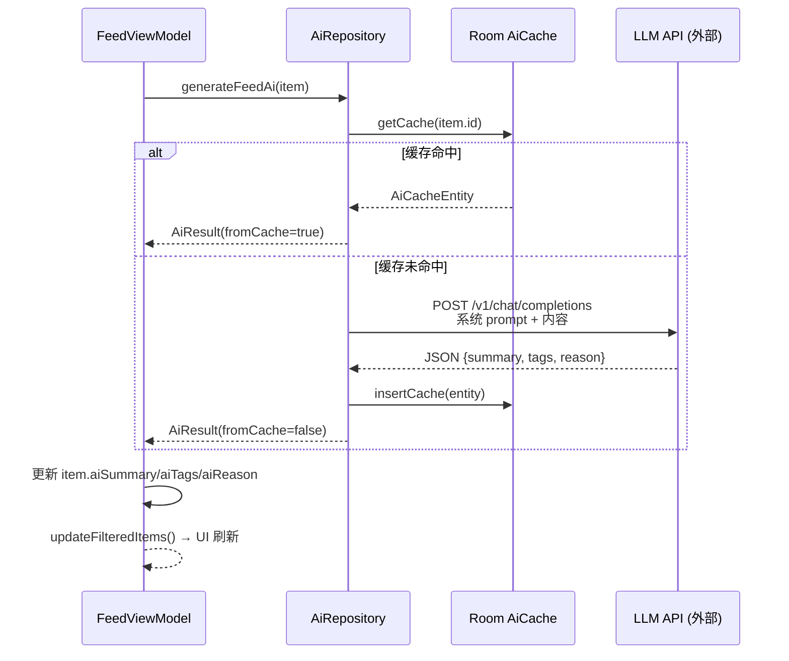
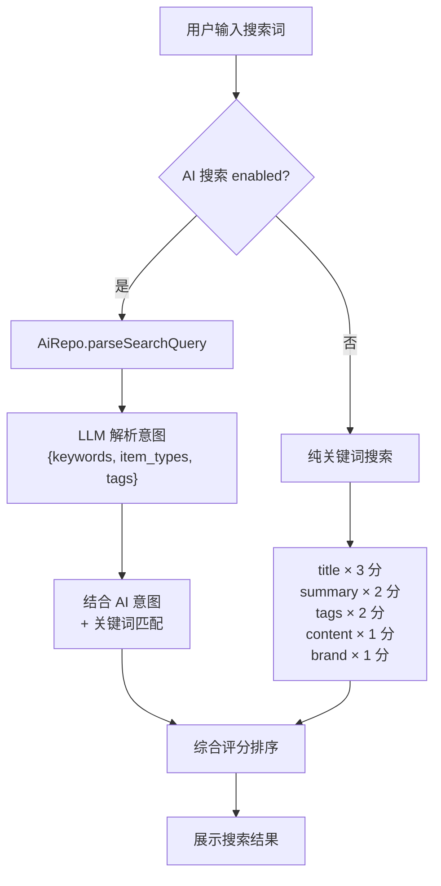

# NekoFeed 项目技术文档 — 组会汇报 & 快速入门

> **文档版本**：2026-06-05 | **适用范围**：组会进度汇报 + 新成员快速上手

---

## 目录

1. [项目概述](#1-项目概述)
2. [系统架构总览](#2-系统架构总览)
3. [技术栈详解](#3-技术栈详解)
4. [项目目录结构](#4-项目目录结构)
5. [核心数据模型](#5-核心数据模型)
6. [数据流与业务逻辑](#6-数据流与业务逻辑)
7. [后端服务详解 (NekoFeedServer)](#7-后端服务详解-nekofeedserver)
8. [Android 客户端详解](#8-android-客户端详解)
9. [AI 能力详解](#9-ai-能力详解)
10. [用户系统](#10-用户系统)
11. [API 接口一览](#11-api-接口一览)
12. [本地开发指南](#12-本地开发指南)
13. [当前开发进度](#13-当前开发进度)

---

## 1. 项目概述

### 1.1 项目定位

**NekoFeed** 是一个 **内容与广告混排的 AI 信息流 Android 客户端**，配合自建的本地 Feed 聚合服务器，实现了从 RSS 内容抓取、AI 智能分析到移动端信息流展示的**全链路系统**。

项目不是一个单纯的广告 Mock 列表，而是一个接近真实生产环境的信息流系统：

```
RSS 新闻源 / 自定义广告 / 视频素材 / 商品广告
         ↓
本地 Feed Server（聚合、清洗、LLM 增强、缓存）
         ↓
统一 FeedItem JSON API
         ↓
Android App（Compose UI、AI 摘要、视频播放、互动统计）
```

### 1.2 核心亮点

| 亮点 | 说明 |
|------|------|
| **统一 FeedItem 模型** | 广告、文章、视频、商品统一抽象，支持内容/广告混排 |
| **本地 Feed Server** | 聚合 RSS + 自定义广告，提供稳定可控的数据源 |
| **双层 AI 增强** | 服务端 LLM 批量分类 + 客户端 LLM 实时摘要/标签 |
| **数据驱动卡片渲染** | 通过 `itemType` × `cardType` 动态选择 5 种卡片组件 |
| **视频播放资源复用** | Media3 ExoPlayer + 100MB LRU 缓存 |
| **完整用户系统** | 匿名设备用户 → 注册用户，互动数据无缝迁移 |
| **乐观更新 + 服务端同步** | 点赞/收藏即时反馈，服务端权威值覆盖 |
| **完整降级方案** | Feed Server / 图片 / 视频 / AI 任一环节失败，App 仍稳定运行 |

---

## 2. 系统架构总览



### 2.1 分层架构理念

整个系统采用**经典的分层架构**：

```
┌─────────────────────────────────────────────────┐
│  UI Layer (Compose Screens + Components)        │  ← 渲染 & 用户交互
├─────────────────────────────────────────────────┤
│  ViewModel Layer (StateFlow + Business Logic)   │  ← 状态管理 & 业务编排
├─────────────────────────────────────────────────┤
│  Repository Layer (数据协调)                     │  ← 数据源选择 & 缓存策略
├─────────────────────────────────────────────────┤
│  Data Source Layer                              │
│  ├── Remote: Retrofit → Feed Server API         │  ← 网络数据
│  ├── Local: Room + DataStore                    │  ← 本地持久化
│  └── Fallback: FallbackFeedData                 │  ← 兜底 Mock 数据
└─────────────────────────────────────────────────┘
```

---

## 3. 技术栈详解

### 3.1 Android 客户端

| 技术 | 用途 | 版本/说明 |
|------|------|----------|
| **Kotlin** | 主开发语言 | JVM 11 |
| **Jetpack Compose** | 声明式 UI 框架 | BOM 管理，Material 3 (1.5.0-alpha20) |
| **Navigation Compose** | 页面路由 | 嵌套 NavHost（主导航 + 底部导航） |
| **Retrofit + OkHttp** | 网络请求 | Gson 序列化，15s 超时，Bearer Token 拦截器 |
| **Coil** | 图片加载 | Compose 集成 |
| **Media3 (ExoPlayer)** | 视频播放 | 100MB LRU 磁盘缓存，单例 PlayerManager |
| **Room** | 本地数据库 | AI 缓存、用户画像、互动记录 3 张表 |
| **DataStore** | 键值存储 | Token、Device ID、LLM 配置、Server URL |
| **KSP** | 注解处理 | Room Compiler |
| **Kotlin Serialization** | JSON 序列化 | 部分序列化场景 |

### 3.2 后端服务 (NekoFeedServer)

| 技术 | 用途 |
|------|------|
| **Python 3.10+** | 主开发语言 |
| **FastAPI** | Web 框架，自动生成 OpenAPI 文档 |
| **Uvicorn** | ASGI 服务器 |
| **SQLAlchemy** | ORM，操作 SQLite |
| **SQLite** | 轻量数据库 (`data/feed.db`) |
| **feedparser** | RSS/Atom 解析 |
| **httpx** | 异步 HTTP 客户端（抓取 RSS、下载媒体） |
| **BeautifulSoup4** | HTML 解析（提取图片、清理摘要） |
| **Jinja2** | Admin 管理页面模板 |
| **python-jose + passlib** | JWT 认证 + bcrypt 密码哈希 |
| **OpenAI-compatible API** | LLM 内容分类增强（Streaming + 非 Streaming 双模式） |

### 3.3 构建与 CI

| 工具 | 说明 |
|------|------|
| **Gradle (Kotlin DSL)** | Android 构建系统 |
| **Version Catalog** | `libs.versions.toml` 统一依赖版本 |
| **GitHub Actions** | 自动编译 CI |

---

## 4. 项目目录结构

### 4.1 总体结构

```
NekoFeed/
├── app/                          # Android 客户端模块
│   ├── build.gradle.kts          # 模块构建配置
│   └── src/main/
│       ├── AndroidManifest.xml
│       ├── java/com/ico/nekofeed/
│       │   ├── MainActivity.kt   # 入口 Activity
│       │   ├── navigation/       # 导航图
│       │   ├── data/             # 数据层
│       │   ├── ui/               # UI 层
│       │   ├── player/           # 视频播放器
│       │   └── util/             # 工具类
│       └── res/                  # 资源文件
├── NekoFeedServer/               # 后端 Python 服务
│   ├── app/                      # FastAPI 应用
│   ├── data/                     # SQLite DB + 媒体缓存
│   ├── seed.py                   # 数据库初始化脚本
│   └── requirements.txt          # Python 依赖
├── Docs/                         # 设计文档
├── NekoFeed-UI/                  # UI 设计稿（暂空）
├── build.gradle.kts              # 根构建文件
├── settings.gradle.kts           # 模块声明
└── gradle.properties             # Gradle 配置
```

### 4.2 Android 客户端详细结构

```
com.ico.nekofeed/
├── MainActivity.kt               # 入口：初始化 Token、Retrofit、认证
│
├── navigation/
│   └── AppNavHost.kt             # 双层导航：根导航 + 嵌套底部导航
│
├── data/
│   ├── model/
│   │   ├── FeedItem.kt           # 核心数据模型 + 枚举（FeedCardType等）
│   │   ├── User.kt               # 用户/交互响应模型
│   │   └── FolderResponse.kt     # Feed 响应包装
│   ├── remote/
│   │   ├── FolderApi.kt          # Retrofit Feed API 接口（20+ 端点）
│   │   ├── OetrofitClient.kt     # Retrofit 单例（动态 BaseURL）
│   │   ├── LlmApi.kt             # LLM API 接口定义
│   │   ├── LlmClientFactory.kt   # LLM Retrofit 客户端工厂
│   │   └── AuthInterceptor.kt    # Token 拦截器
│   ├── local/
│   │   ├── TokenManager.kt       # DataStore 持久化配置
│   │   ├── FallbackFeedData.kt   # 内置 Mock 兜底数据
│   │   └── db/
│   │       ├── NekoFeedDatabase.kt           # Room DB（3表）
│   │       ├── AiCacheDao.kt / Entity.kt     # AI 结果缓存
│   │       ├── UserProfileDao.kt / Entity.kt # 用户偏好画像
│   │       └── FeedItemInteractionDao.kt / Entity.kt # 本地互动记录
│   └── repository/
│       ├── FeedRepository.kt     # Feed 数据获取 + 缓存
│       ├── AiRepository.kt       # AI 摘要/标签/搜索
│       ├── AuthRepository.kt     # 登录/注册/Token管理
│       ├── UserRepository.kt     # 用户互动同步
│       ├── UserProfileRepository.kt  # 本地用户画像
│       └── FolderRepository.kt   # Feed 数据的 Repository 实现
│
├── ui/
│   ├── theme/
│   │   ├── Color.kt / Theme.kt / Type.kt  # Material 3 主题
│   ├── components/
│   │   └── BottomNavigationBar.kt          # 底部导航栏
│   ├── feed/
│   │   ├── FolderScreen.kt       # 信息流首页
│   │   ├── FolderViewModel.kt    # 首页 ViewModel（500+ 行）
│   │   └── components/
│   │       ├── FeedItemCard.kt         # 卡片路由（根据 cardType 分发）
│   │       ├── LargeImageFeedCard.kt   # 大图卡片
│   │       ├── SmallImageFeedCard.kt   # 小图卡片
│   │       ├── VideoFeedCard.kt        # 视频卡片
│   │       ├── ProductFeedCard.kt      # 商品卡片
│   │       ├── FolderItemCard.kt       # 通用 Feed 卡片
│   │       └── FeedTagChip.kt          # 标签 Chip 组件
│   ├── detail/
│   │   └── FeedDetailScreen.kt   # 详情页（图文/视频/商品自适应）
│   ├── search/
│   │   ├── SearchScreen.kt       # 搜索页（普通搜索 + AI 搜索）
│   │   └── SearchViewModel.kt
│   ├── stats/
│   │   └── StatsScreen.kt        # 统计可视化页
│   ├── auth/
│   │   ├── LoginScreen.kt        # 登录页
│   │   ├── RegisterScreen.kt     # 注册页
│   │   └── AuthViewModel.kt
│   ├── profile/
│   │   └── ProfileScreen.kt      # 个人中心
│   ├── interaction/
│   │   ├── UserInteractionScreen.kt    # 我的点赞/收藏/历史
│   │   └── UserInteractionViewModel.kt
│   └── settings/
│       ├── AiSettingsScreen.kt   # AI 设置页
│       └── AiSettingsViewModel.kt
│
├── player/
│   └── PlayerManager.kt         # ExoPlayer 单例管理器
│
└── util/
    ├── UiState.kt                # FeedUiState 定义
    └── IntentUtils.kt            # 系统 Intent 工具
```

### 4.3 后端服务详细结构

```
NekoFeedServer/
├── app/
│   ├── main.py               # FastAPI 入口 + 路由挂载 + 静态文件
│   ├── database.py           # SQLAlchemy 引擎 + Session 工厂
│   ├── models.py             # ORM 模型（6 张表）
│   ├── schemas.py            # Pydantic 请求/响应模型
│   ├── auth.py               # JWT 认证 + 设备用户自动创建
│   ├── routers/
│   │   ├── api.py            # Feed 核心 API（/api/feed 等）
│   │   ├── admin.py          # Admin 管理面板路由
│   │   ├── user.py           # 用户认证 API（注册/登录/资料）
│   │   └── user_interaction.py  # 互动 API（点赞/收藏/历史）
│   ├── services/
│   │   ├── feed_fetcher.py    # RSS 抓取 + 处理流水线
│   │   ├── item_normalizer.py # RSS Entry → FeedItem 归一化
│   │   ├── media_cache.py     # 图片/视频异步下载缓存
│   │   ├── llm_enrichment.py  # LLM 内容分类增强（Streaming）
│   │   └── llm_config.py      # LLM 配置管理
│   ├── static/               # Admin 页面静态资源
│   └── templates/            # Jinja2 Admin 模板
├── data/
│   ├── feed.db               # SQLite 数据库文件
│   └── media/
│       ├── images/           # 缓存的图片文件
│       └── videos/           # 缓存的视频文件
├── seed.py                   # 初始化数据（7 个 RSS 源 + 5 个广告）
└── requirements.txt          # Python 依赖
```

---

## 5. 核心数据模型

### 5.1 FeedItem — 全局统一模型

`FeedItem` 是贯穿前后端的**核心抽象**，将广告、文章、视频、商品统一为一个数据结构：

```kotlin
data class FeedItem(
    val id: String,               // 唯一标识（MD5 hash）

    // 基础内容
    val title: String,
    val summary: String?,         // 原始摘要
    val content: String?,         // 原始正文

    // 来源信息
    val sourceName: String?,      // 来源名称（如 "36Kr"）
    val sourceUrl: String?,       // 原文链接

    // 分类与类型
    val category: String?,        // 内容分类（tech, ad, local...）
    val itemType: String?,        // 内容类型 ← 决定业务逻辑
    val cardType: String?,        // 卡片类型 ← 决定 UI 渲染

    // 媒体资源
    val imageUrl: String?,        // 封面图 URL
    val mediaUrl: String?,        // 视频/媒体 URL

    // AI 分析结果
    val aiSummary: String?,       // AI 生成的一句话摘要
    val aiTags: List<String>?,    // AI 生成的标签
    val aiReason: String?,        // AI 推荐理由

    // 广告专属字段
    val brand: String?,           // 品牌名
    val ctaText: String?,         // CTA 按钮文案
    val priceText: String?,       // 价格/优惠文本
    val isSponsored: Boolean,     // 是否为赞助内容

    // 互动状态（来自服务端）
    val isLiked: Boolean,
    val isCollected: Boolean,
    val likeCount: Int,
    val collectCount: Int,
    val shareCount: Int,

    // 统计计数（客户端本地）
    val exposureCount: Int,
    val clickCount: Int,
    val playCount: Int,

    // 时间
    val publishedAt: String?,
    val isAiLoading: Boolean      // 正在请求 AI 分析
)
```

### 5.2 类型枚举

#### FeedItemType — 内容类型（决定业务逻辑）

| 值 | 含义 | 说明 |
|----|------|------|
| `article` | 文章 | 普通资讯/新闻/博客 |
| `video` | 视频 | 视频内容，使用 ExoPlayer 播放 |
| `ad` | 广告 | 品牌展示广告 |
| `product` | 商品 | 商品/产品推荐广告 |
| `local` | 本地生活 | 探店/美食/线下活动 |

#### FeedCardType — 卡片类型（决定 UI 渲染）

| 值 | 含义 | 使用的组件 |
|----|------|-----------|
| `large_image` | 大图卡片 | `LargeImageFeedCard` |
| `small_image` | 小图卡片 | `SmallImageFeedCard` |
| `video` | 视频卡片 | `VideoFeedCard` |
| `text_only` | 纯文本 | 无图卡片 |
| `product` | 商品卡片 | `ProductFeedCard` |

#### FeedCategory — 频道分类

| 值 | 显示名 | 说明 |
|----|--------|------|
| `featured` | 精选 | 全部内容，不过滤 |
| `tech` | 科技 | 科技资讯 |
| `ai` | AI | AI 相关内容 |
| `business` | 商业 | 商业资讯 |
| `local` | 本地 | 本地生活 |
| `video` | 视频 | 视频内容 |
| `shopping` | 电商 | 商品/广告 |

### 5.3 服务端数据库表结构



---

## 6. 数据流与业务逻辑

### 6.1 Feed 加载流程



### 6.2 点赞交互流程（乐观更新 + 服务端同步）



### 6.3 AI 分析流程



### 6.4 搜索流程



---

## 7. 后端服务详解 (NekoFeedServer)

### 7.1 RSS 抓取流水线

```
用户触发刷新（Admin面板 / API）
       ↓
feed_fetcher.fetch_and_process_feed()
       ↓  httpx 异步抓取 RSS XML
       ↓
feedparser.parse() 解析 RSS/Atom
       ↓  取前 20 条 entry
       ↓
item_normalizer.normalize_feed_item()
  ├── 提取标题、摘要（清理 HTML）
  ├── 提取图片 URL（media_content → media_thumbnail → enclosures → HTML img）
  ├── 提取视频 URL（media_content → enclosures）
  ├── 解析发布时间（多格式兼容）
  ├── 生成唯一 ID（MD5(link)）
  └── 自动推断 item_type 和 card_type
       ↓
media_cache.download_media()
  ├── MD5(URL) 作为文件名
  ├── 图片失败则跳过整条 item
  └── 视频失败仍保留 item
       ↓
写入 SQLite feed_items 表
```

### 7.2 LLM 内容增强

服务端的 LLM 增强主要做**内容分类**（不做摘要/标签，那个由客户端做）：

```python
# 输入
标题：{title}  来源：{source_name}  分类：{category}  摘要：{summary[:300]}

# 输出 JSON
{
  "category": "数码",          # 更精确的分类
  "item_type": "product",      # 更精确的类型
  "brand": "酷比魔方",          # 品牌（如可推断）
  "cta_text": "立即抢购",       # CTA 文案
  "price_text": "￥2599",       # 价格文本
  "is_sponsored": false         # 是否赞助
}
```

特点：
- **Streaming + 非 Streaming 双模式**：先尝试 Streaming，3 次失败后降级为非 Streaming
- **自动重试**：指数退避，最多 3 次
- **进度追踪**：全局 `enrichment_status` 字典，Admin 面板实时展示进度
- **容错 JSON 解析**：能处理不完整 JSON、Markdown 代码块包裹等情况

### 7.3 用户认证机制

```
                    ┌──────────────┐
                    │  App 启动     │
                    └──────┬───────┘
                           ↓
              ┌──── 有 Bearer Token? ────┐
              │                          │
             YES                        NO
              │                          │
              ↓                          ↓
      解析 JWT token            有 X-Device-Id?
      查找对应用户                      │
              │                  YES          NO
              ↓                   │            │
         返回登录用户            查找/创建      返回 None
                              设备用户         (匿名)
```

**关键设计**：登录/注册时自动将设备用户的互动数据（likes, collects, history）迁移到真实用户账号，实现**匿名 → 登录的无缝过渡**。

---

## 8. Android 客户端详解

### 8.1 导航架构

App 采用**双层嵌套导航**：

```
根 NavHost (navController)
├── "login"       → LoginScreen
├── "register"    → RegisterScreen
├── "main"        → MainScreen（包含底部导航栏）
│   └── 嵌套 NavHost (nestedNavController)
│       ├── "feed"         → FeedScreen（首页信息流）
│       ├── "detail/{id}"  → FeedDetailScreen（详情页）
│       ├── "search"       → SearchScreen（搜索页）
│       ├── "stats"        → StatsScreen（统计页）
│       ├── "profile"      → ProfileScreen（个人中心）
│       ├── "likes"        → UserInteractionScreen（我的点赞）
│       ├── "collections"  → UserInteractionScreen（我的收藏）
│       ├── "history"      → UserInteractionScreen（浏览历史）
│       └── "ai_settings"  → AiSettingsScreen（AI 设置）
├── "profile"     → ProfileScreen（直接跳转入口）
└── "ai_settings" → AiSettingsScreen（直接跳转入口）
```

底部导航栏页面使用 `saveState = true` 和 `restoreState = true`，支持**页面切换时保留滚动状态**。

### 8.2 FeedViewModel — 核心业务逻辑（500+ 行）

`FeedViewModel` 是整个 App 最核心的 ViewModel，管理以下职责：

```kotlin
class FeedViewModel(application: Application) : AndroidViewModel(application) {
    // ① Feed 数据加载
    fun loadFeed()          // 首次加载 / 切换分类
    fun loadMore()          // 上拉加载更多
    fun refresh()           // 下拉刷新

    // ② 分类过滤
    fun selectCategory()    // Tab 切换分类
    fun filterByTag()       // 标签点击过滤

    // ③ 用户互动
    fun toggleLike()        // 点赞（乐观更新 + 服务端同步 + 失败回滚）
    fun toggleCollect()     // 收藏（同上）
    fun toggleShare()       // 分享

    // ④ 埋点统计
    fun recordExposure()    // 曝光记录（去重）
    fun recordClick()       // 点击记录（同时记录浏览历史）

    // ⑤ AI 分析
    fun requestAiAnalysis() // 单条 AI 分析（Semaphore 并发控制=2）
    fun batchGenerateAi()   // 批量 AI 分析（私有，加载后自动触发）

    // ⑥ 搜索 & 统计
    fun searchItems()       // 关键词评分搜索
    fun getStats()          // 聚合统计数据
}
```

### 8.3 卡片渲染路由

根据 `cardType` 字段动态选择渲染组件：

```kotlin
when (FeedCardType.fromString(item.cardType)) {
    FeedCardType.LARGE_IMAGE → LargeImageFeedCard(...)   // 大图：顶部大图 + 标题 + 摘要 + 标签
    FeedCardType.SMALL_IMAGE → SmallImageFeedCard(...)   // 小图：左文右图布局
    FeedCardType.VIDEO       → VideoFeedCard(...)        // 视频：封面图 + 播放按钮 + ExoPlayer
    FeedCardType.PRODUCT     → ProductFeedCard(...)      // 商品：商品图 + 价格 + CTA 按钮
    FeedCardType.TEXT_ONLY   → SmallImageFeedCard(...)   // 无图退化为小图布局
}
```

### 8.4 视频播放管理

`PlayerManager` 是一个**全局单例**，核心特点：

```kotlin
class PlayerManager private constructor(context: Context) {
    val exoPlayer: ExoPlayer    // 单一播放器实例
    var isMuted: Boolean        // 默认静音

    // 100MB LRU 磁盘缓存 + CacheDataSource
    // 循环播放模式 (REPEAT_MODE_ONE)
    // 播放时自动判断是否需要重新 prepare
}
```

列表中同一时间**只允许一个视频播放**，通过 `FeedViewModel.playingItemId` 状态控制。

### 8.5 本地存储策略

| 存储 | 技术 | 数据 |
|------|------|------|
| **DataStore** | Preferences DataStore | Token、Device ID、Server URL、LLM Config |
| **Room DB** | SQLite | AI 缓存（7天自动清理）、用户偏好画像、互动记录 |
| **内存缓存** | MutableStateFlow | 当前 Feed 列表、UI 状态、曝光去重集合 |
| **磁盘缓存** | Media3 SimpleCache | 视频文件（100MB LRU） |

---

## 9. AI 能力详解

### 9.1 双层 AI 架构

| 层 | 位置 | 功能 | 触发时机 |
|----|------|------|---------|
| **服务端 AI** | NekoFeedServer / llm_enrichment.py | 内容分类、品牌识别、CTA/价格推断 | Admin 手动触发批量处理 |
| **客户端 AI** | Android / AiRepository.kt | 一句话摘要、智能标签、推荐理由 | 加载 Feed 后自动 + 详情页手动 |

### 9.2 客户端 AI Prompt 设计

**内容分析 Prompt**：
```
系统：你是一个内容分析助手，请对以下信息流内容进行分析，用中文输出 JSON。
格式：{"summary":"一句话摘要(≤50字)","tags":["标签1","标签2","标签3"],"reason":"推荐理由(≤30字)"}

用户：标题：{title}
类型：{itemType}
原始摘要：{summary}
```

**搜索意图解析 Prompt**：
```
系统：你是一个搜索理解助手。用户画像偏好标签：{tags}。
请解析用户搜索意图，用 JSON 输出。
格式：{"keywords":["词1"],"item_types":["article","ad"],"tags":["标签"],"explanation":"AI理解：..."}

用户：{query}
```

### 9.3 AI 配置管理

用户可在 **AI 设置页** 自定义：
- LLM Endpoint URL（支持 OpenAI 兼容接口）
- API Key
- 模型名称
- 功能开关（AI 摘要 / 智能搜索）
- 连接测试

配置存储在 DataStore 中，支持动态切换不同 LLM 后端。

---

## 10. 用户系统

### 10.1 三态用户模型

```
匿名用户 (None)
    │  首次发送 X-Device-Id
    ↓
设备用户 (device_xxx)
    │  注册/登录
    ↓
正式用户 (username)
    互动数据自动迁移 ✓
```

### 10.2 支持的用户操作

| 操作 | 匿名 | 设备用户 | 正式用户 |
|------|:----:|:-------:|:-------:|
| 浏览 Feed | ✓ | ✓ | ✓ |
| 点赞/收藏 | ✗ | ✓ | ✓ |
| 浏览历史 | ✗ | ✓ | ✓ |
| 我的点赞/收藏/历史列表 | ✗ | ✗ | ✓ |
| 修改资料 | ✗ | ✗ | ✓ |
| 修改密码 | ✗ | ✗ | ✓ |

---

## 11. API 接口一览

### 11.1 Feed API

| 方法 | 路径 | 说明 |
|------|------|------|
| `GET` | `/api/feed` | 获取 Feed 列表（分页、分类、类型过滤） |
| `GET` | `/api/items/{id}` | 获取单条 Feed 原始记录 |
| `POST` | `/api/refresh` | 触发全部 RSS 刷新 |
| `POST` | `/api/feeds/{id}/refresh` | 触发单个 Feed 刷新 |
| `GET` | `/api/rss.xml` | RSS 2.0 XML 输出 |

### 11.2 用户认证 API

| 方法 | 路径 | 说明 |
|------|------|------|
| `POST` | `/api/auth/register` | 注册（自动迁移设备数据） |
| `POST` | `/api/auth/login` | 登录（自动迁移设备数据） |
| `GET` | `/api/auth/me` | 获取当前用户信息 |
| `PUT` | `/api/auth/me` | 修改用户资料 |
| `POST` | `/api/auth/change-password` | 修改密码 |
| `GET` | `/api/auth/stats` | 获取用户统计 |

### 11.3 互动 API

| 方法 | 路径 | 说明 |
|------|------|------|
| `POST` | `/api/items/{id}/like` | 切换点赞状态 |
| `POST` | `/api/items/{id}/collect` | 切换收藏状态 |
| `POST` | `/api/items/{id}/history` | 记录浏览历史 |
| `GET` | `/api/items/{id}/interaction` | 获取条目互动状态 |
| `GET` | `/api/user/likes` | 我的点赞列表 |
| `GET` | `/api/user/collections` | 我的收藏列表 |
| `GET` | `/api/user/history` | 我的历史列表 |
| `DELETE` | `/api/user/history` | 清空历史 |

---

## 12. 本地开发指南

### 12.1 启动后端服务

```bash
# 1. 进入 Server 目录
cd NekoFeedServer

# 2. 安装 Python 依赖
pip install -r requirements.txt

# 3. 初始化数据库（插入 RSS 源 + 广告数据）
python seed.py

# 4. 启动服务
uvicorn app.main:app --reload --host 0.0.0.0 --port 8000

# 5. 打开管理后台刷新 RSS
# 浏览器访问 http://localhost:8000/admin
# 点击 "Refresh All Now" 抓取 RSS 内容
```

### 12.2 运行 Android App

```bash
# 1. 用 Android Studio 打开项目根目录
# 2. Sync Gradle
# 3. 选择模拟器或真机
# 4. Run app 模块
```

> [!IMPORTANT]
> - **模拟器**：Server URL 默认为 `http://10.0.2.2:8000`（模拟器访问宿主机）
> - **真机**：需要手动在 App 设置中修改 Server URL 为电脑局域网 IP
> - 如果 Server 未启动，App 会自动使用**内置 Fallback 数据**

### 12.3 配置 AI 功能

1. 打开 App → 个人中心 → AI 设置
2. 填写 LLM Endpoint URL（如 `http://10.0.2.2:11434`）
3. 填写 API Key（如需要）
4. 选择模型（如 `qwen2.5:7b`）
5. 点击「测试连接」验证
6. 开启 AI 摘要 / 智能搜索开关

---

## 13. 当前开发进度

### 13.1 Git 提交历史

| 提交 | 内容 |
|------|------|
| `cc6f2bc` | 初始化项目 |
| `9a4e925` ~ `8b083f2` | 完整功能实现 |
| `ee273d3` | 添加后端 Feed Server |
| `4b25501` | 添加用户系统（注册/登录/设备用户） |
| `4abdf55` | 修复点赞/收藏崩溃 |
| `524238a` | GitHub Actions 自动编译 |
| `2457583` | LLM 功能实现（客户端 AI） |
| `046e5ca` ~ `39e2f32` | LLM bug 修复 + 加载优化 |
| `7af321b` ~ `66e8574` | Material Design 3 Expressive 主题 |
| `91488d1` | 服务端 LLM 增强（批量分类） |
| `9bc3842` | 收藏/点赞 bug 修复 + UUID + 视频播放器 |

### 13.2 功能完成度

#### ✅ 已完成（核心功能）

- [x] Android App 从 Feed Server 请求 `/api/feed`
- [x] 统一 `FeedItem` 数据模型
- [x] FeedScreen 单列混合信息流
- [x] 大图、小图、视频、商品 4 种卡片
- [x] FeedDetailScreen 详情页（图文/视频/商品自适应）
- [x] 点赞、收藏、分享（乐观更新 + 服务端同步）
- [x] 曝光、点击统计 + StatsScreen 可视化
- [x] 下拉刷新、上拉加载更多
- [x] 服务不可用时内置 Mock 数据兜底
- [x] Tab 频道切换（精选/科技/AI/商业/本地/视频/电商）
- [x] 完整用户系统（注册/登录/设备用户/数据迁移）
- [x] 个人中心（点赞列表/收藏列表/浏览历史）
- [x] ExoPlayer 视频播放 + 100MB 磁盘缓存
- [x] Material 3 Expressive 主题
- [x] GitHub Actions 自动编译 CI

#### ✅ 已完成（AI 功能）

- [x] 客户端 AI 摘要/标签/推荐理由
- [x] 批量 AI 分析（加载后自动触发）
- [x] 单条 AI 分析（详情页手动触发）
- [x] AI 结果 Room 缓存（7天自动清理）
- [x] AI 搜索意图解析
- [x] AI 设置页面（Endpoint/Key/Model/测试连接）
- [x] 服务端 LLM 批量内容分类增强
- [x] Streaming + 非 Streaming 双模式 LLM 调用

#### ✅ 已完成（后端）

- [x] FastAPI 服务 + SQLite
- [x] RSS 抓取 + 归一化 + 媒体缓存
- [x] Admin 管理面板
- [x] JWT 认证 + 设备用户体系
- [x] 互动 API（点赞/收藏/历史）
- [x] 数据库初始化脚本（7 个 RSS 源 + 5 个广告）

#### 🔲 可优化项

- [ ] NekoFeed-UI 设计稿落地
- [ ] 推荐算法（当前按时间排序）
- [ ] 服务端 AI 摘要/标签（当前只做分类）
- [ ] 完播率统计
- [ ] 图片 / 视频加载失败的重试机制优化
- [ ] 生产级 RSS 定时抓取（当前需手动触发）
- [ ] 搜索结果 highlight

---

> [!TIP]
> **汇报建议**：重点展示 ① 系统架构图（前后端分离 + 双层 AI） ② 卡片渲染效果 ③ 乐观更新交互流程 ④ AI 摘要 demo，这四个点最能体现项目的技术深度和完成度。
