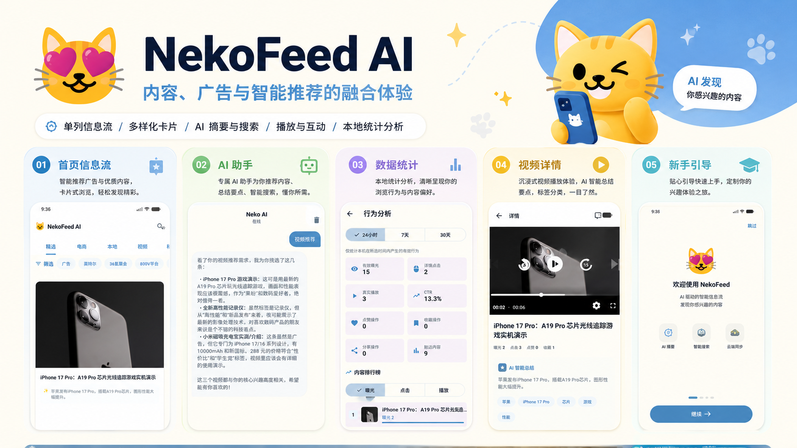

# NekoFeed



NekoFeed 是一个“内容与广告混排”的 Android 单列信息流项目。系统由 Jetpack Compose 客户端和 FastAPI 本地 Feed Server 组成：服务端聚合 RSS/Atom 与自定义广告并归一化为统一 `FeedItem`，客户端负责分类浏览、多样式卡片、视频播放、AI 摘要/标签/对话搜索、用户互动和曝光统计。

[视频演示](https://my.feishu.cn/file/TdcJbrKRoozBn2xR4m4csEDKnrf)

最新发布版本：[`v1.6.1`](https://github.com/iconteral/NekoFeed/releases/tag/v1.6.1)

建议优先下载 Release 版本：Release 包面向正式使用与演示，通常比 Debug 包更稳定，也更不容易出现卡顿；Debug 版本主要用于开发调试。

原始题目与范围见 [Docs/原需求.md](Docs/原需求.md)，技术实现见 [Docs/TECHNICAL_DESIGN.md](Docs/TECHNICAL_DESIGN.md)。

## 功能概览

- 文章、广告、商品、本地生活和视频内容混排
- 大图、小图、商品、视频等 Compose 卡片
- 分类切换、标签筛选、刷新、分页与本地降级数据
- Media3 单实例视频播放、滚出暂停和播放失败回退
- 注册登录、点赞、收藏、历史、分享与跨页面状态同步
- AI 摘要、标签、推荐理由和对话式 Feed 搜索
- 本地事件级曝光、点击、播放、点赞、收藏、分享统计
- FastAPI 管理后台、RSS 抓取、媒体缓存和 OpenAI-compatible LLM 配置

## 技术栈

| 端 | 技术 |
| --- | --- |
| Android | Kotlin、Jetpack Compose、Material 3、ViewModel、Coroutines/Flow |
| 数据与网络 | Retrofit、OkHttp、Room、DataStore、Coil |
| 视频 | AndroidX Media3 / ExoPlayer |
| Server | Python、FastAPI、SQLAlchemy、SQLite、Feedparser、Jinja2 |
| AI | OpenAI-compatible Chat Completions 接口，可在客户端或服务端配置 |

## 环境要求

- Android Studio，JDK 11
- Android SDK 37；最低 Android 7.0（API 24）
- Python 3.10 或更高版本

## 快速运行

### 1. 启动 Feed Server

```powershell
cd NekoFeedServer
python -m venv .venv
.\.venv\Scripts\Activate.ps1
pip install -r requirements.txt
python seed.py
python -m uvicorn app.main:app --host 0.0.0.0 --port 8000 --reload
```

启动后可访问：

- 管理后台：`http://127.0.0.1:8000/admin`
- Feed API：`http://127.0.0.1:8000/api/feed`
- OpenAPI：`http://127.0.0.1:8000/docs`

`seed.py` 会写入默认 RSS 源和演示广告。首次抓取可在后台执行刷新；RSS 与外部媒体依赖网络，断网时客户端仍可选择 Mock 模式。

### 2. 启动 Android App

1. 用 Android Studio 打开仓库根目录并等待 Gradle 同步。
2. 启动 API 24+ 模拟器或连接真机。
3. 运行 `app` 配置。
4. 首次引导选择数据模式并填写服务地址。

地址约定：

- Android Emulator 访问本机：`http://10.0.2.2:8000`（默认）
- 真机访问电脑：`http://<电脑局域网 IP>:8000`
- 纯演示：在首次引导或设置中启用 Mock 模式

命令行构建：

```powershell
.\gradlew.bat testDebugUnitTest
.\gradlew.bat assembleDebug
```

Debug APK 输出到 `app/build/outputs/apk/debug/app-debug.apk`。

## AI 配置

项目不包含 API Key。AI 功能支持 OpenAI-compatible 接口：

- 客户端设置页：填写 Base URL、模型和 API Key，用于即时摘要和智能搜索。
- 服务端 `/admin/llm`：填写同类配置，用于批量内容增强。
- 未配置或请求失败时：保留原摘要/标签，Feed 浏览、互动和统计仍可使用。

生产环境不应在客户端分发长期密钥；建议通过受控服务端代理并配置鉴权、限流和密钥轮换。

## 模块划分

```text
app/src/main/java/com/ico/nekofeed/
├── data/local/       DataStore、Room、Mock/降级数据
├── data/remote/      Retrofit API 与 LLM Client
├── data/repository/  Feed、AI、认证、互动、用户数据
├── navigation/       Compose 路由
├── player/           Media3 单播放器管理
├── ui/               feed/detail/search/chat/stats/settings 等页面
└── util/             分类规则、Intent 与通用状态

NekoFeedServer/app/
├── routers/          Feed、认证、互动、管理后台 API
├── services/         RSS 抓取、归一化、媒体缓存、LLM 增强
├── templates/        Jinja2 管理后台
├── models.py         SQLAlchemy 模型
├── schemas.py        API Schema
└── database.py       SQLite 与轻量迁移
```

## 开发规范

- UI 状态由 ViewModel 持有，以不可变数据和 `StateFlow` 驱动 Compose。
- 网络、持久化、业务规则分别放在 remote/local/repository，Composable 不直接访问数据库或 HTTP。
- 服务端 API 使用 snake_case，Android 模型通过 `@SerializedName` 显式映射。
- 新增 Feed 类型时同步更新模型、服务端归一化、卡片分发、详情行为和统计测试。
- 不提交 API Key、数据库、媒体缓存、APK、IDE 配置或本机 `local.properties`。
- 提交前至少运行单元测试与 Debug 构建；共享规则变更必须补测试。
- Git 提交建议使用 `feat:`、`fix:`、`docs:`、`test:`、`refactor:` 前缀并保持单一职责。

## 文档与验收

- [技术设计](Docs/TECHNICAL_DESIGN.md)
- [学习总结](Docs/LEARNING_SUMMARY.md)
- [指标口径与验收记录](Docs/METRICS_AND_VALIDATION.md)
- [服务端说明](NekoFeedServer/README.md)

## AI 使用声明

本项目开发过程中使用了生成式 AI 辅助需求拆解、方案讨论、代码草拟、故障定位和文档整理。所有进入仓库的代码与文档均由开发者结合实际代码审阅、修改，并通过本地编译或测试验证；AI 生成内容不作为正确性的唯一依据。

运行时 AI 仅在用户主动配置兼容接口后启用。仓库不包含第三方模型权重和密钥；发送给模型的内容主要是 Feed 标题、摘要、标签及搜索问题。真实部署前应补充隐私告知、数据脱敏和服务提供方合规评估。
